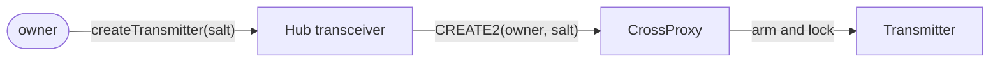
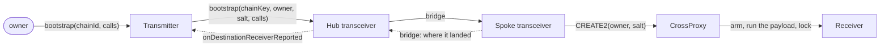
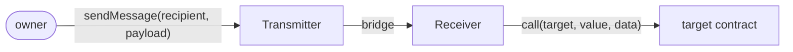
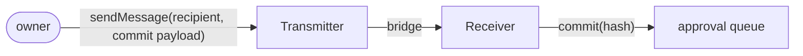
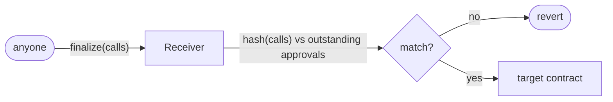

# crossecute protocol

Secure multisig operations across chains, anchored on one of them.

## Why

A team on six chains runs six multisigs: six addresses, six signer sets to keep in step,
six proposals per change, six sets of funded signers. Everything below follows from
collapsing that to one.

**A signer is removed once, not N times.** The signer set exists only in the home-chain
multisig. Receivers elsewhere never learn who the signers are: they authenticate the
origin address, fixed by CREATE2 at creation and unmoved by a signer change. Rotating a
compromised key is one transaction, not N with a live attacker in the gaps.

**One decision, one authorization, one fan-out.** A change touching six chains is one
payload, approved once, dispatched from one home-chain transaction. Team and DAO process
stops scaling with the number of chains.

The atomicity is in the authorization, not the settlement: messages land when their bridges
deliver, and a revert on one chain leaves that chain behind until retry rather than rolling
back the others (see [Failure handling](docs/message-flow.md#failure-handling)). What it
removes is divergence at the point of decision: six chains cannot hold six different
payloads when only one was approved.

**No per-chain multisig UI in the path.** Acting on a chain today needs someone's Safe
deployment there and someone's interface up: canonical, Protofire's, or self-hosted. Here
every operation starts on the home chain, so one interface covers all of them, and a chain
needs no Safe at all: the authority on the spoke is the account this protocol deploys.

**Gas is funded in one place.** A multisig only one person can afford to execute is not
decentralized, so an operable Safe per chain means N signers funded on M chains in M
currencies. Here signers transact only at home. The bridge fee is paid there in one
currency and execution runs inside the delivery callback. A payload that spends native
currency draws on the receiver's address, which is derivable and fundable before the
receiver exists: topped up once, not per signer.

**One admin address everywhere.** The same exact CREATE2 address holds the account on every
supported chain, which unifies access control. Chain exceptions that do not use Ethereum's
CREATE2 formula, eg. Tron and zkSync, are derived uniquely and reported back to central authority.

**One payload to verify, not M.** Reviewing calldata is the expensive part of an operation,
and M chains means M batches reviewed separately plus the work of confirming they agree.
Here it is one batch, reviewed in totality. The commitment folds the destination chainKey
in with the calls, so an approval names what runs _and_ where: confirming a payload
confirms its destination, and the same bytes cannot be replayed onto another chain.

**What it costs.** The home chain and the message provider enter the trust path: a halt at
home delays everything, and a provider that can forge a message can drive an account. No
shared failure is exactly what N independent multisigs buy with N of everything else. The
exposure is narrowed where it can be: a transceiver's upgrade key dies in the call that
initializes it and an account's in the call that arms it, so neither is ever live and
replaceable, and no shared contract sits in the path of a normal message.

## Three transactions

Everything the protocol does is one of these. The first is local, the second crosses once per
chain, and the third is every message after that.

### 1 · Creating a transmitter

Home chain only, no bridge. The owner claims an address that is theirs on every parity chain
before anything exists on any of them.



The owner is `msg.sender` by construction, so nobody can squat an address another party
intends to use. Arming installs the logic, runs the initializer, and zeroes the upgrade key in
one call, so it is never live afterwards. The same three CREATE2 inputs are used on every
chain, so this address is also where the owner's receivers will land.

### 2 · Creating a receiver: bootstrap

The one path a transceiver is on. There is no peer on the destination yet, so the message
goes to the one contract that already exists there.



The message carries the owner and their salt, not the transmitter, because a CREATE2 address
cannot be derived from itself. The dashed return leg fires only where `addressesDiverge` —
zkSync and Tron — since elsewhere the hub derived the receiver's address before the first
message left. It is sent from inside the delivery callback at the fee its own quote names, so
an underfunded spoke reverts and takes the account creation with it: all or nothing, and
retryable once it is funded. This runs once per chain.

### 3 · Sending a message

After bootstrap the transmitter is its own message-provider endpoint, sending straight to its
receiver. No shared contract is in the path.

The transmitter refuses any recipient that is not the counterpart it recorded, chain half
included, and the receiver accepts only its own transport and its own transmitter on the other
side. Execution is in order and all or nothing.

A payload either runs when it lands or waits for someone to supply it. Nothing on the wire
distinguishes the two: committing is a call, not a message kind, which is why there is no
message-type tag anywhere in the protocol.

#### 3a · Execute on arrival

The payload names a target, and the receiver calls it inside the delivery callback. Nobody
has to come back for it.



#### 3b · Approve now: the commitment

The same path, carrying a payload whose one element calls the receiver's own `commit`. It
lands, executes, and what it leaves behind is a hash.



#### 3c · Run later: finalize

Anyone supplies the array afterwards, and pays for it. The receiver hashes what it was given
and looks for a matching outstanding approval, so what runs is what was approved.



The check is why `finalize` needs no caller gate: exactly one of "the payload is checked" or
"the caller is checked" holds, and each entry point picks a different one. The hash folds in
the local chainKey, so an array approved for one chain cannot be finalized on another.

## The idea

**One owner, one address, every chain.** An owner's account is deployed at
`CREATE2(transceiver, keccak256(owner, salt), CrossProxy)`, and because all three inputs
are the same everywhere, so is the address. On the **home chain** it is armed with
transmitter logic and driven by its owner; on every other chain it is armed with receiver
logic and driven by messages from the first. Same address, different half.

**The home chain is a choice.** Ethereum is the expected anchor and the reason the protocol
reads that way, but nothing requires it: a team can centralize on whichever chain they are
willing to anchor to, and every spoke names that one instead. A spoke is exactly as rigid
either way: its home chainKey, route, and counterpart are all written once at
initialization with no setters. What the home chain _must_ be is an EVM chain with the
EIP-152 precompile, because the registry recomputes addresses and commitments locally.

Only bootstrap involves a transceiver, and it runs once per chain. After it, the account
talks to its counterpart directly and no shared contract is in the path of a normal message.

**The send and receive surfaces are ERC-7786's.** `TransmitterBase` is an
`IERC7786GatewaySource` and `ReceiverBase` an `IERC7786Recipient`, so `recipient` is a
binary interoperable address (ERC-7930) that carries its own chain and `payload` is opaque
`bytes`. One signature therefore covers every destination, and the transceiver's route slot
holds a chain identifier rather than a provider's private id for a chain. The standard
defines no quote, so `quoteMessage` is the protocol's own addition alongside it.

**Committing is a call, not a message kind.** To approve a payload now and run it later,
send one whose single element calls the receiver's own `commit`. Nothing on the wire
distinguishes it from any other payload, which is why there is no message-type tag anywhere
in the protocol.

## Layout

```
src/
  addressing/     Erc7930, ChainType, ChainKey, Move        no imports outside itself
  derivation/     AddressDerive, VmDeriver, Starknet/Sui, Blake2b256
  registry/       ChainRegistry, Provenance, IRefValidator, IChainRegistryRefs
                  ICommitmentScheme
  validators/     StarknetValidator, MoveValidator          pluggable, per chainKey
  schemes/        Keccak, Sha256, Blake2b                   pluggable, per chainKey
  messaging/      Commitment, Call, Payload, Envelope, Executor, Roles
                  IErc7786                                  vendored, ERC-7786's two
    outbound/     OutboundBase -> TransmitterBase
    inbound/      InboundBase -> ReceiverBase           what both halves RECEIVE with
    transceiver/  TransceiverBase -> Hub
      spoke/      SpokeTransceiverBase -> zkSync / Tron
  account/        CrossProxy                                what both halves ARE
  treasury/       Treasury                                  where fees land, Ownable
  protocols/      per message provider; the only files naming an SDK
```

Dependencies run one way: `addressing` is a leaf, and nothing above it is imported by
anything below:

```
addressing <- derivation <- registry <- validators
     ^                          ^
     +------- messaging --------+ <- protocols
```

There is no `libs/` or `utils/`. A folder named for what a file _is not_ is a place to put
things rather than a statement about them.

## Where the reasoning lives

Every design decision is argued in the contract that implements it. This is an index, not a
summary: the file is always the newer statement.

| Question                                                                 | Answered in                           |
| ------------------------------------------------------------------------ | ------------------------------------- |
| Why one address, and why a proxy rather than a clone                     | `account/CrossProxy.sol`              |
| How an account is created, and why its upgrade key dies in the same call | `TransceiverBase._createCrossAccount` |
| Why a hub makes transmitters and a spoke makes receivers                 | `TransceiverBase`, `Hub` / `Spoke`    |
| Why approvals are an unordered map of hash to count                      | `inbound/InboundBase.sol`             |
| Why a transceiver receives, and why it cannot cancel                     | `inbound/InboundBase.sol`, `TransceiverBase` |
| Why the wire carries a payload rather than a digest                      | `outbound/OutboundBase.sol`           |
| Why `Call[]` reaches EVM chains and opaque `bytes[]` everything else     | `messaging/Payload.sol`               |
| Why a commitment is defined over elements nothing here parses            | `messaging/Commitment.sol`            |
| Why a chain is graded, and what each grade is worth                      | `registry/Provenance.sol`             |
| Why the hub holds counterparts and the registry holds their grade        | `HubTransceiverBase.setCounterpart`   |
| Why routes live on the transceiver rather than in the registry           | `HubTransceiverBase.setRoute`         |
| Why the hub owns, the spoke does not, and the roles are not authorities   | `messaging/Roles.sol`, `HubTransceiverBase` |
| Why a treasury is a role on one contract and an owner on another         | `treasury/Treasury.sol`               |
| Why a chain type needs more than a `ChainType` constant                  | `addressing/Erc7930.sol`              |
| Why the commitment _preview_ is swappable when the commitment is not     | `registry/ICommitmentScheme.sol`      |
| Why the route slot holds a chain identifier, not a provider's id         | `TransceiverBase._recipientOn`        |
| Why the recipient is checked rather than trusted, and only on `eip155`   | `TransmitterBase.sendMessage`         |

## Adding a chain type

Two steps, and the second is the one nothing will remind you about.

1. **Allocate the `ChainType` constant** in `addressing/ChainType.sol`, and nowhere else.
   Every value used in the repo is allocated in that one file, because a ChainType is baked
   into every envelope and registry keys are `keccak256(envelope)`: two files each picking a
   provisional value is a silent collision that surfaces as two chains sharing a key. Use the
   CASA CAIP-350 value where one exists; otherwise take the next free slot at or above
   `PROVISIONAL_FLOOR` and accept that a published profile later means a re-keying migration.

2. **Write the profile's canonicity rule into `Erc7930.parseStrict`**, beside the eip155 and
   starknet cases. `chainType` is read as an opaque `uint16` and never checked against the
   allocation table, so an unallocated value already parses and registers — it simply arrives
   with no canonicity condition attached, and both `0x00cafe` and `0xcafe` pass as references
   for the same chain and hash to two different keys. Allocating the constant does not close
   that; only the rule does. `test/UnknownChainType.t.sol` pins the current behaviour.

Then, per destination: a `Scheme` or `ICommitmentScheme` plugin if the chain does not hash
with keccak256, an `IVmDeriver` if its addresses can be recomputed here, an `IRefValidator`
if the envelope cannot express its value ranges, and a `setProvenance` grade below `Derived`
if its addresses cannot be recomputed here at all.

## Assumptions

- All contracts are created through Arachnid's CREATE2 factory with a salt: `0x4e59..`
  where it exists; zk-chains use their own.
- Compiled against `evm_version = "paris"`, pinned in `contracts/evm/foundry.toml`. PUSH0
  (Shanghai) is absent on zkSync, Tron, and several L2s, and CREATE2 parity requires
  byte-identical initcode on every chain, so the target must not vary. Optimizer settings
  are pinned for the same reason, as are `bytecode_hash = "none"` and
  `cbor_metadata = false`: solc's default trailer carries an IPFS hash of the source,
  comments included, which would otherwise put every derived address one comment edit
  away from moving.
- Transceivers are deployed as upgradeable proxies and the upgrade that installs the real
  implementation runs the initializer that locks upgrades. A transceiver decides which
  cross-chain payloads are authentic, so a live upgrade key is a standing ability to forge
  one, and there is no window in which it exists.
- Accounts are `CrossProxy` and lock in the same call that arms them. There is no reachable
  state in which one has real logic and a live upgrade key.
- OpenZeppelin 5.4.0, vendored in `lib/` rather than submoduled. The version is an
  address-determining input like the compiler pin: `CrossProxy`'s initcode compiles OZ's
  `Proxy`, `ERC1967Utils`, and (through them) `Address`, so a bump that changes any of their
  bytes moves every account on every chain. ERC-7786's two interfaces are vendored at
  `src/messaging/IErc7786.sol` instead of imported, because they are a `draft-` upstream and
  this protocol's ABI here.
- The crossecute msig owns the registry, every transceiver, and the treasury each
  transceiver pays. Ownership is the only live authority: a transceiver's transports and its
  treasury are named in the `Deployment` it is initialized with, and neither role has an
  administrator: `grantRole` is `onlyInitializing`, so nothing can add a member afterwards.
  A compromised owner cannot admit a transport, cannot drop one — a transceiver is shared by
  every owner on its chain — and can move fees only to an address that already held
  `TREASURY_ROLE` when the contract was deployed. An account is one owner's, so a receiver
  may drop its own gateway through `revokeGateway`, which is the only membership change that
  survives initialization anywhere.

## Docs

- [`docs/message-flow.md`](docs/message-flow.md): the two paths, wire formats, and what
  each contract does
- [`docs/encoding.md`](docs/encoding.md): call serialization, the commitment preimage, and
  what changes off the EVM
- [`docs/provider-spec.md`](docs/provider-spec.md): what a message provider binding must
  implement to be compliant, and what the provider itself must be capable of. Normative
- [`docs/provider-research.md`](docs/provider-research.md): what each transport actually
  guarantees about replay, and how ERC-7786 attaches. Pinned to other people's releases, so
  it goes stale on their schedule rather than ours
- [`docs/todo.md`](docs/todo.md): everything outstanding, ordered by what blocks what

## Status

The EVM side is built and tested: account creation, the approval queue, cancellation,
execution, per-destination commitment schemes, and both message paths end to end in-process.

```
cd contracts/evm && forge test        # 346 passing
```

**Nothing crosses a real bridge yet.** `_sendMessage` reverts `SendNotImplemented` and
`_quoteMessage` reverts `QuoteNotImplemented` until a protocol binding overrides them, and
`LzReceiver` grants `GATEWAY_ROLE` to nobody, so a receiver accepts nothing. No provider
is bound: `LzTransmitter` and friends are structure without an SDK behind them. That is the
next thing to build, and every remaining path waits on it.
