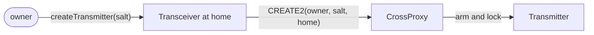
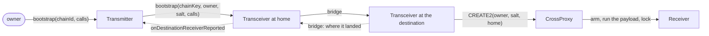
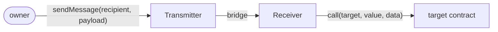
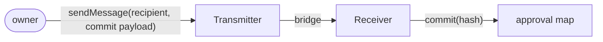
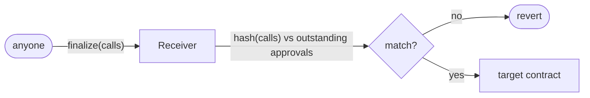

# crossecute protocol

Secure multisig operations across chains, anchored on whichever one each account chooses.

## Why

A team on six chains runs six multisigs: six addresses, six signer sets to keep in step,
six proposals per change, six sets of funded signers. Everything below follows from
reducing that to one.

**A signer is removed once, not N times.** The signer set exists only in the multisig on the
account's home, whichever chain the team picks. Receivers elsewhere never learn who the signers
are: they authenticate the origin address, fixed by CREATE2 at creation and unmoved by a signer
change. Rotating a compromised key is one transaction, not N with a live attacker in the gaps.

**One decision, one authorization, one fan-out.** A change touching six chains is one payload,
approved once, dispatched from one transaction on the account's home. Team and DAO process stops
scaling with the number of chains.

The atomicity is in the authorization, not the settlement: messages land when their bridges
deliver, and a revert on one chain leaves that chain behind until retry rather than rolling
back the others (see [Failure handling](docs/message-flow.md#failure-handling)). What it
removes is divergence at the point of decision: six chains cannot hold six different
payloads when only one was approved.

**No per-chain multisig UI in the path.** Acting on a chain today needs someone's Safe
deployment there and someone's interface up: canonical, Protofire's, or self-hosted. Here every
operation starts on the account's home, so one interface covers all of them, and a chain needs
no Safe at all: the authority on every other chain is the account this protocol deploys.

**Gas is funded in one place.** A multisig only one person can afford to execute is not
decentralized, so an operable Safe per chain means N signers funded on M chains in M
currencies. Here signers transact only at home. The bridge fee is paid there in one
currency, by the transmitter from its own balance at the price quoted in the same
transaction, so signers approve a payload and never a price. Execution runs inside the
delivery callback. A payload that spends native
currency draws on the receiver's address, which is derivable and fundable before the
receiver exists: topped up once, not per signer.

**One admin address everywhere.** The same CREATE2 address holds the account on every
supported chain, which unifies access control. Chains whose CREATE2 formula differs from
EIP-1014's, such as Tron and zkSync, derive their own address and report it back to the
account's home.

**One payload to verify, not M.** Reviewing calldata is the expensive part of an operation,
and M chains means M batches reviewed separately plus the work of confirming they agree.
Here it is one batch, reviewed in totality. The commitment folds the destination chainKey
in with the calls, so an approval names what runs _and_ where: confirming a payload
confirms its destination, and the same bytes cannot be replayed onto another chain.

**What it costs.** The account's home chain and the message provider enter the trust path. A
halt at home delays everything, and a provider that can forge a message can drive an account. No
shared failure is what N independent multisigs buy with N of everything else. The exposure is
narrowed where it can be. A transceiver's one upgrade is the call that installs and initializes
it, after which it has no upgrade function; an account's upgrade key dies in the call that arms
it; and the registry has no upgrade path at all. None is ever live and replaceable. No shared
contract sits in the path of a normal message.

The rest of the bill, stated plainly:

- **A home cannot move.** It is part of the account's address. A team that wants another
  home makes another account.
- **Configuration is N × N.** Every chain's transceiver needs every other chain's route and
  provider id. Their one source is `contracts/evm/deploy/`; nothing turns it into the
  governance payloads yet.
- **A registry bug means new transceivers.** The registry is fixed and a transceiver's pointer
  to it is write-once, so a fix moves that chain's accounts.
- **Governance is slow on purpose.** A registry or treasury change crosses a bridge and then
  waits out a timelock.
- **OP Stack is two providers.** `op-stack-l1-l2` connects Ethereum and each OP Stack chain;
  `op-stack-l2-l2` connects OP Stack chains through Superchain interop, and is not deployable
  until interop is live.

## Three transactions

Everything the protocol does is one of these. The first is local, the second crosses once per
chain, and the third is every message after that.

### 1 · Creating a transmitter

On the chain the owner picks as home, no bridge. The owner claims an address that is theirs
on every parity chain before anything exists on any of them.


```mermaid
flowchart LR
    Owner([owner]) -->|"createTransmitter(salt)"| T[Transceiver at home]
    T -->|"CREATE2(owner, salt, home)"| Proxy[CrossProxy]
    Proxy -->|"arm and lock"| Tx[Transmitter]
```

The owner is `msg.sender` by construction, so nobody can squat an address another party
intends to use. Arming installs the logic, runs the initializer, and zeroes the upgrade key in
one call, so it is never live afterwards. The same three CREATE2 inputs are used on every
chain, so this address is also where the owner's receivers will land.

### 2 · Creating a receiver: bootstrap

The one path a transceiver is on. There is no peer on the destination yet, so the message
goes to the one contract that already exists there.


```mermaid
flowchart LR
    Owner([owner]) -->|"bootstrap(chainId, calls)"| Tx[Transmitter]
    Tx -->|"bootstrap(chainKey, owner, salt, calls)"| Home[Transceiver at home]
    Home -->|"bridge"| Dest[Transceiver at the destination]
    Dest -->|"CREATE2(owner, salt, home)"| Proxy[CrossProxy]
    Proxy -->|"arm, run the payload, lock"| Rx[Receiver]
    Dest -.->|"bridge: where it landed"| Home
    Home -.->|"onDestinationReceiverReported"| Tx
```

Both transceivers are the same contract: one per chain per provider, at one address on every
standard EVM chain, creating transmitters for accounts homed on its chain and receivers for
accounts homed elsewhere. The account's home is whichever chain the bootstrap authenticated
as its origin, never a field the message states.

The message carries the owner and their salt, from which the destination derives the account's
own address, and the transmitter's address, which the receiver will answer to. The home's
transceiver sends only for the account that pair resolves to, so the destination needs no
other chain's address formula, and zkSync and Tron can be homes too. The dashed return arrow
fires only where `addressesDiverge`, which is zkSync and Tron as destinations. Elsewhere the
home derived the receiver's address before the first message left. The report is sent from
inside the delivery callback at the fee its own quote names, paid from the transceiver's
float, so an underfunded float reverts and takes the account creation with it: all or
nothing, and retryable once it is funded. This runs once per chain.

A bootstrap may carry the account's whole first payload. A large one should pass a gas
attribute, since no provider's default gas has been measured against it, or carry only a
call to the new receiver's own `commit`, so anyone can `finalize` the payload there later
and pay for it.

### 3 · Sending a message

After bootstrap the transmitter is its own message-provider endpoint, sending straight to its
receiver. No shared contract is in the path.

The transmitter refuses any recipient that is not the counterpart it recorded, chain half
included, and the receiver accepts only its own transport and its own transmitter on the other
side. Execution is in order and all or nothing.

A payload either runs when it lands or waits for someone to supply it. Nothing on the wire
distinguishes the two: committing is a call, not a message kind, which is why an account's
payload carries no message-type tag. Only the envelopes transceivers exchange are tagged.

#### 3a · Execute on arrival

The payload names a target, and the receiver calls it inside the delivery callback. Nobody
has to come back for it.


```mermaid
flowchart LR
    Owner([owner]) -->|"sendMessage(recipient, payload)"| Tx[Transmitter]
    Tx -->|"bridge"| Rx[Receiver]
    Rx -->|"call(target, value, data)"| Target[target contract]
```

#### 3b · Approve now: the commitment

The same path, carrying a payload whose one element calls the receiver's own `commit`. It
lands, executes, and what it leaves behind is a hash.


```mermaid
flowchart LR
    Owner([owner]) -->|"sendMessage(recipient, commit payload)"| Tx[Transmitter]
    Tx -->|"bridge"| Rx[Receiver]
    Rx -->|"commit(hash)"| Map[approval map]
```

#### 3c · Run later: finalize

Anyone supplies the array afterwards, and pays for it. The receiver hashes what it was given
and looks for a matching outstanding approval, so what runs is what was approved.


```mermaid
flowchart LR
    Anyone([anyone]) -->|"finalize(calls)"| Rx[Receiver]
    Rx -->|"hash(calls) vs outstanding approvals"| Check{match?}
    Check -->|"no"| Revert([revert])
    Check -->|"yes"| Target[target contract]
```

An empty array is refused, so there is never an approval of nothing to discharge. The
check is why `finalize` needs no caller gate: exactly one of "the payload is checked" or
"the caller is checked" holds, and each entry point picks a different one. The hash folds in
the local chainKey, so an array approved for one chain cannot be finalized on another.

## The idea

**One owner, one address, every chain.** An owner's account is deployed at
`CREATE2(transceiver, keccak256(abi.encode(owner, salt, homeChainKey)), CrossProxy)`, and
because all three inputs are the same everywhere, so is the address. The home chain is part
of the salt, so the same owner and salt homed on two chains are two accounts, and an owner
can mine `salt` for a vanity or gas-cheap address. On the **home chain** it is armed with
transmitter logic and driven by its owner; on every other chain it is armed with receiver
logic and driven by messages from the first. Same address, different half.

**Any chain can be home.** An owner picks a home per account by calling `createTransmitter`
there, and every other chain already has what it needs to receive from it: one deployment
serves every home. The home is fixed for the life of the account. A chain's registry
derives Sui addresses and previews BLAKE2b commitments with the EIP-152 precompile, where
those plugins are configured; on a chain without it they revert rather than answer wrongly,
and which target chains have it is unverified.

**Governance is an account like any other.** Every transceiver is owned by the governor's
own account on its chain, derived at initialization from the governor's owner, salt, and
home rather than typed, and configured by payloads sent from that home like any other
account's. The governor's home is a deployment parameter, not a fixed chain; it has to be
`Predetermined` from every chain, since each transceiver is born accepting the bootstrap
that creates its owner. No Safe, key, or deployer handover is needed on any other chain.

**The send and receive surfaces are ERC-7786's.** `TransmitterBase` is an
`IERC7786GatewaySource` and `ReceiverBase` an `IERC7786Recipient`, so `recipient` is a
binary interoperable address (ERC-7930) that carries its own chain and `payload` is opaque
`bytes`. One signature therefore covers every destination, and the transceiver's route slot
holds a chain identifier rather than a provider's private id for a chain. The standard
defines no quote, so `quoteMessage` is the protocol's own addition alongside it.

## Layout

```
src/
  addressing/     Erc7930, ChainType, ChainKey, Move        no imports outside itself
  derivation/     AddressDerive, VmDeriver, Starknet/Sui, Blake2b256
  registry/       ChainRegistry, Provenance, IRefValidator, IChainRegistryRefs
                  ICommitmentScheme
  validators/     StarknetValidator, MoveValidator          pluggable, per chainKey
  schemes/        Keccak, Sha256, Blake2b                   pluggable, per chainKey
  messaging/      Commitment, Call, Payload, Envelope, Executor, Roles
                  IErc7786                                  vendored, ERC-7786's two
    outbound/     OutboundBase -> TransmitterBase -> OwnableTransmitter
    inbound/      ReceiverBase                          what an account RECEIVES with
    transceiver/  TransceiverBase -> zkSync / Tron          one per chain per provider
                  DivergentAccounts                         zkSync and Tron derivation
  account/        CrossProxy                                what both halves, and transceivers, ARE
                  CrossProxyDeployer                        arms a transceiver's proxy in one call
  treasury/       Treasury                     one per chain: fees and the report float
  protocols/      per message provider; the only files naming an SDK
script/
  deploy/         shared deploy checks, one deploy per provider    tests deploy through these
  Deploy*.s.sol   production entry points, one per provider
  vendor/         provenance drivers for hand-copied SDK files
deploy/           chains.toml, providers/*.toml: chain facts, provider ids
```

Paths under `script/` and `deploy/` are relative to `contracts/evm/`.

Dependencies run one way: `addressing` is a leaf, and nothing above it is imported by
anything below:

```
addressing <- derivation <- registry <- validators
     ^                          ^
     +------- messaging --------+ <- protocols
```

There is no `libs/` or `utils/`. A folder named for what a file _is not_ is a place to put
things rather than a statement about them.

## Where the reasoning lives

Every design decision is argued in the contract that implements it. This is an index, not a
summary: the file is always the newer statement.

| Question                                                                 | Answered in                           |
| ------------------------------------------------------------------------ | ------------------------------------- |
| Why one address, and why a proxy rather than a clone                     | `account/CrossProxy.sol`              |
| How an account is created, and why its upgrade key dies in the same call | `TransceiverBase._createCrossAccount` |
| Why one transceiver makes both transmitters and receivers               | `TransceiverBase`                     |
| Why approvals are an unordered map of hash to count                      | `inbound/ReceiverBase.sol`            |
| Why a transceiver receives, and why it runs no payload                   | `TransceiverBase`                     |
| Why the wire carries a payload rather than a digest                      | `outbound/OutboundBase.sol`           |
| Why `Call[]` reaches EVM chains and opaque `bytes[]` everything else     | `messaging/Payload.sol`               |
| Why a commitment is defined over elements nothing here parses            | `messaging/Commitment.sol`            |
| Why a chain is graded, and what each grade is worth                      | `registry/Provenance.sol`             |
| Why the transceiver holds counterparts and the registry their grade      | `TransceiverBase.setCounterpart`      |
| Why routes live on the transceiver rather than in the registry           | `TransceiverBase.setRoute`            |
| Why the owner configures and the roles are not authorities               | `messaging/Roles.sol`, `TransceiverBase` |
| Why the bootstrap fee is paid to the treasury in the same transaction    | `TransceiverBase._bootstrapSendValue` |
| Why each account is homed on its authenticated origin                   | `TransceiverBase._handleInbound`      |
| Why the report float leaves only at the treasury's call                  | `TransceiverBase.withdraw`, `Treasury.collect` |
| Why a chain's grade is write-once and suspension is the cut-off          | `registry/ChainRegistry.sol`          |
| Why zkSync and Tron derive accounts their own way, and what is unverified  | `transceiver/DivergentAccounts.sol`   |
| Why a chain type needs more than a `ChainType` constant                  | `addressing/Erc7930.sol`              |
| Why the commitment _preview_ is swappable when the commitment is not     | `registry/ICommitmentScheme.sol`      |
| Why the route slot holds a chain identifier, not a provider's id         | `TransceiverBase._recipientOn`        |
| Why the recipient is checked rather than trusted, and only on `eip155`   | `TransmitterBase.sendMessage`         |

## Adding a chain type

A chain of a type the protocol already has, such as another standard EVM chain, needs no new
contracts: see [`contracts/evm/deploy/README.md`](contracts/evm/deploy/README.md). A new type
takes two steps, and the second is the one nothing will remind you about.

1. **Allocate the `ChainType` constant** in `addressing/ChainType.sol`, and nowhere else.
   Every value used in the repo is allocated in that one file, because a ChainType is
   written into every envelope and registry keys are `keccak256(envelope)`: two files each picking a
   provisional value is a silent collision that surfaces as two chains sharing a key. Use the
   CASA CAIP-350 value where one exists; otherwise take the next free slot at or above
   `PROVISIONAL_FLOOR` and accept that a published profile later means a re-keying migration.

2. **Write the profile's canonicity rule into `Erc7930.parseStrict`**, beside the eip155 and
   starknet cases. `chainType` is read as an opaque `uint16` and never checked against the
   allocation table, so an unallocated value already parses and registers. It simply arrives
   with no canonicity condition attached, and both `0x00cafe` and `0xcafe` pass as references
   for the same chain and hash to two different keys. Allocating the constant does not close
   that; only the rule does. `test/UnknownChainType.t.sol` pins the current behaviour.

Then, per destination, add what the chain needs:

- a `Scheme` or `ICommitmentScheme` plugin, if it does not hash with keccak256
- an `IVmDeriver`, if its addresses can be recomputed here
- an `IRefValidator`, if the envelope cannot express its value ranges
- a grade below `Predetermined` when it is registered, if its addresses cannot be recomputed
  here at all; the grade is write-once. An EVM chain is `Predetermined` only if its transceivers
  are deployed through `CrossProxyDeployer`, which needs Arachnid's factory. One without that
  factory is `Unique` in every registry, and grades every other chain `Unique` in its own

## Message providers

Six native bindings live under `src/protocols/`. Each is held to
[`docs/provider-spec.md`](docs/provider-spec.md). Each is one transceiver per chain, with
zkSync and Tron variants where the provider reaches those chains. On a transceiver, the
delivery's origin names a chain and the sender must be that chain's counterpart. Where the
bindings differ is in who delivers a message to an account and what authenticates it:

| Provider | Inbound entry point | Sender authenticated by | Replay refused by |
| --- | --- | --- | --- |
| LayerZero | `lzReceive`, from the endpoint | the vendored OApp's peer check, then `GATEWAY_ROLE` and the source transmitter | the endpoint |
| CCIP | `ccipReceive`, from the router | `GATEWAY_ROLE` and the source transmitter | the off-ramp |
| Hyperlane | `handle`, from the Mailbox | `GATEWAY_ROLE`, the Mailbox's ISM, and the source transmitter | the Mailbox |
| Wormhole | `executeVAAv1`, from anyone | guardian signatures through Core, the emitter, and the VAA's `(targetChain, targetAddress)` prefix | the binding's own consumed-hash set |
| OP Stack, L1 ↔ L2 | `receiveOpStackMessage`, from the messenger that reaches the account's home | `GATEWAY_ROLE` and `xDomainMessageSender()` read during the relay | the messenger |
| OP Stack, L2 ↔ L2 | `receiveInteropMessage`, from the `L2ToL2CrossDomainMessenger` | `GATEWAY_ROLE` and `crossDomainMessageSender()` read during the relay | the messenger |

What an operator or integrator has to know:

- **Transports are fixed at initialization, and a disconnect is permanent.** `grantRole` is
  `onlyInitializing`, so a provider that migrates its endpoint means redeploying the
  transceiver unless its initializer's `gateways` named both endpoints up front. On an account,
  `revokeGateway` only subtracts. A receiver that drops its transport has no way to
  reconnect, and because `CrossProxy` arms once it cannot be redeployed at that address, so
  that owner's account on that chain stops receiving for good. This is deliberate: a
  re-grant path would be a fallback-override surface.
- **Provider ids named at deploy cannot be corrected.** Each entry in a transceiver's id
  table (eid, selector, domain, or Wormhole chain) and every LayerZero peer is write-once. A
  receiver's peer is set by its initializer; a transceiver's or transmitter's is set once per
  eid by its owner. Fixing a wrong one means a redeploy, or for a transmitter a new account.
- **LayerZero's inbound check is partly in vendored code.** Auditing it means reading
  `lib/layerzero-oapp-evm-upgradeable/.../OAppCoreUpgradeable.sol` and
  `OAppReceiverUpgradeable.sol` alongside `src/protocols/layerzero/`. Every other binding
  checks in this repo's own code. Each LayerZero account is its own OApp delegate.
- **Provider-side security configuration is the provider's default.** No contract here sets
  a LayerZero DVN or library configuration, or a Hyperlane `interchainSecurityModule()`. So
  the Mailbox owner's replaceable `defaultIsm` and LayerZero's default configuration decide
  what counts as a verified message.
- **A CCIP receiving contract must keep answering `supportsInterface`.** If it stops answering
  true for `IAny2EVMMessageReceiver`, the off-ramp marks each message executed without ever
  calling `ccipReceive`. The message is lost silently rather than reverted.
  `CcipInterfaceSupportTest` pins the receiver's answer and `CcipTransceiver.t.sol` the
  transceiver's, on the plain and zkSync versions, so any inheritance change to the CCIP
  contracts has to keep them.
- **Wormhole delivery is permissionless.** Anyone may submit a VAA, and liveness does not
  depend on the Executor quoter, which is an implementation immutable.
- **OP Stack sends carry no value and cost only gas.** The quote is zero, so a send spends
  nothing from the account, and the binding refuses a nonzero `value` because the messenger
  would bridge it rather than spend it. `op-stack-l1-l2`'s transceiver holds, per chain,
  the messenger that reaches it, write-once: on Ethereum one `L1CrossDomainMessenger` per OP
  Stack chain, on each OP Stack chain the `L2CrossDomainMessenger` predeploy, which reaches
  only Ethereum. A delivery's origin is the chain of the messenger that called.
- **OP Stack interop carries no value and no options, and needs a relayer.**
  `op-stack-l2-l2`'s messenger takes no value and no gas limit, so the quote is zero and any
  attribute is refused; the relay is a separate transaction whose sender picks the gas. A send
  reaches only a routed chain, which should be one in the sender's dependency set.
- **Vendored provider code has no update path.** SDK files are hand-copied into `lib/`,
  pinned per file to a commit by `contracts/evm/script/vendor/<provider>.sh`. An upstream
  security fix has to be noticed, re-vendored, and diffed by hand. It then reaches no
  deployed contract, since transceivers and accounts lock on initialization.

## Assumptions

- `CrossProxyDeployer` is created through Arachnid's CREATE2 factory (`0x4e59..`), which puts
  it at one address on every standard EVM chain; transceivers are created through
  `CrossProxyDeployer`, and accounts by their transceiver's own CREATE2. A chain is
  `Predetermined` only if its transceivers were deployed that way; zkSync and Tron, whose
  CREATE2 formulas differ, and any chain without Arachnid's factory are `Unique`.
- Compiled against `evm_version = "paris"`, pinned in `contracts/evm/foundry.toml`. PUSH0
  (Shanghai) is absent on zkSync, Tron, and several L2s, and CREATE2 parity requires
  byte-identical initcode on every chain, so the target must not vary. Optimizer settings
  are pinned for the same reason, as are `bytecode_hash = "none"` and
  `cbor_metadata = false`: solc's default trailer carries an IPFS hash of the source,
  comments included, which would otherwise put every derived address one comment edit
  away from moving.
- Transceivers and accounts are all `CrossProxy`, and each locks in the same call that arms
  it. `CrossProxyDeployer` deploys a transceiver, installs its implementation, runs its
  initializer, and zeroes the admin in one call, under a salt bound to its caller so nobody
  else can take the address first. The implementation has no upgrade function. A
  transceiver decides which cross-chain payloads are authentic, so a live upgrade key would
  be a standing ability to forge one, and there is no reachable state in which one exists.
- Nothing is upgraded after deployment. `ChainRegistry` is a plain contract with no proxy, so
  accounts, transceivers, and the registry all keep sequential storage with no gaps: no later
  version ever has to match their layout.
- OpenZeppelin 5.4.0 and forge-std 1.16.2, submodules pinned to exact commits and fetched
  from forks in the crossecute org, each holding its commit under its own tag, so a deleted
  or force-pushed upstream tag cannot break the build. The same commits are in
  `contracts/evm/foundry.lock`; a bump made with `git` alone has to update it by hand. The
  OZ version is an address-determining input like the compiler pin: `CrossProxy`'s initcode
  compiles OZ's `Proxy`, `ERC1967Utils`, and (through them) `Address`, so a bump that changes
  any of their bytes moves every account on every chain. These are the versions to ship on.
  OZ 5.5's `Arrays` uses `mcopy`, which breaks `AccessControlEnumerableUpgradeable` at
  `paris` (`Roles.sol`), and v6's `ReentrancyGuardTransient` needs Cancun. ERC-7786's two
  interfaces are vendored at `src/messaging/IErc7786.sol` instead of imported, because they
  are a `draft-` upstream and this protocol's ABI here.
- A transmitter holds only pre-funded bridging fees. Every send and bootstrap is paid from
  that balance at a quote nothing caps, so value kept there for any other purpose is exposed
  to the transceiver owner's bootstrap fee and to a provider's price.
- Each chain has one `ChainRegistry` and one `Treasury`, shared by every provider there. A
  chain's grade, and so whether it reports its receivers, is given when it is registered and
  never changes; a chain can be suspended, which only refuses. Both are `Ownable`. The
  deployment design gives each chain one `TimelockController` with a 48-hour delay as their
  owner, where the governor's accounts under two providers propose and cancel, so a compromised
  provider can freeze them but not take them. That step is not scripted yet, so nothing
  enforces that design today.
- A bootstrap fee is forwarded to the chain's `Treasury` in the transaction that charges it,
  so no transceiver holds an accrued fee. A transceiver holds only the float for its receiver
  reports, funded out of band, and that leaves only when the treasury pulls it with
  `Treasury.collect`.
- Ownership is the only live authority, and it cannot admit a transport, drop one, or
  repoint a treasury. An account is one owner's, so a receiver may drop its own gateway through
  `revokeGateway`, which is the only membership change that survives initialization
  anywhere. `renounceOwnership` stays available everywhere: it retires that transmitter,
  transceiver, registry, or treasury for good, and that is the owner's call.

## Docs

- [`docs/message-flow.md`](docs/message-flow.md): the two paths, the wire formats, and how
  the contracts fit together
- [`docs/encoding.md`](docs/encoding.md): call serialization, the commitment preimage, and
  what changes off the EVM
- [`docs/provider-spec.md`](docs/provider-spec.md): what a message provider binding must
  implement to be compliant, and what the provider itself must be capable of. Normative
- [`docs/provider-research.md`](docs/provider-research.md): what each transport actually
  guarantees about replay, and how ERC-7786 attaches. Pinned to other people's releases, so
  it goes stale on their schedule rather than ours
- [`docs/todo.md`](docs/todo.md): everything outstanding, ordered by what blocks what

## Status

The EVM side is built and tested: account creation, the approval map, cancellation,
execution, per-destination commitment schemes, both message paths end to end in-process,
and native bindings for LayerZero, CCIP, Hyperlane, Wormhole, and OP Stack (L1 ↔ L2, and L2 ↔ L2
over interop).

```
git submodule update --init           # forge-std, OZ, OZ-upgradeable, from the crossecute forks
cd contracts/evm && forge test        # 749 passing
```

CI runs the same build and tests, plus `forge fmt --check` and `forge lint`, on every pull
request (`.github/workflows/test.yml`). `src/` is linted a second time under the `lint-src`
profile, which also enforces the detector heuristics the default profile leaves off for tests.
`forge build --sizes src` fails if any contract exceeds EIP-170's 24,576-byte limit, which
`forge test` does not check.

Each provider's transceiver deploys with `forge script script/Deploy<Provider>.s.sol`, which
reads its inputs from the environment (listed in `script/DeployProvider.s.sol`) and the
salt and deployer from the chain registry's record, and provider ids from `deploy/`. The test
suites deploy through the same functions under `script/deploy/`, so a deployment makes every
check the tests do. [`contracts/evm/deploy/README.md`](contracts/evm/deploy/README.md) says
what adding a chain takes.

**Nothing has crossed a real bridge yet.** Every binding is tested against a mock of its
provider, and only the transceiver step of a chain's deployment is scripted. Both are tracked
in [`docs/todo.md`](docs/todo.md).
