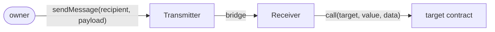
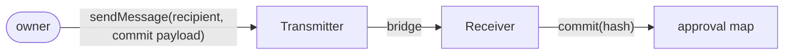
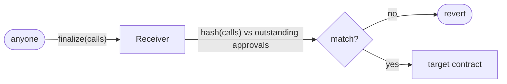
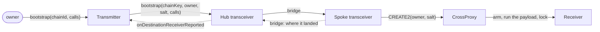

# Message flow

The two paths a message takes, the wire formats, and how the contracts fit together.

**Status.** Both paths are built end to end in-process: `_sendMessage`, `sendMessage` /
`bootstrap`, the quote surface, the inbound funnel, and the reentrancy guard. The send and
receive surfaces are ERC-7786's: `TransmitterBase` is an `IERC7786GatewaySource` and
`ReceiverBase` an `IERC7786Recipient`. What is missing is a **message provider binding**.
`_sendMessage` reverts `SendNotImplemented` and `_quoteMessage` reverts
`QuoteNotImplemented` by default, so nothing crosses a real bridge yet. What a binding must
implement is in [`provider-spec.md`](provider-spec.md).

**Where the reasoning lives.** Each design decision is argued in the contract that
implements it. This file says what the pieces are and how they connect; for why any of it
is shaped the way it is, read the NatSpec in the file named. Where the two disagree, the
contract is right.

## Three properties the whole design turns on

**The home chain is a parameter.** Ethereum is the expected anchor, and a spoke names its
home (chainKey, provider route, and counterpart) once at initialization with no setters.
Everything below reads "hub" and "spoke" rather than "Ethereum" and "elsewhere" for that
reason.

1. **A transmitter is its own message-provider endpoint.** It sends to its receiver
   directly, so the transceiver is not in the path of a normal message.
2. **The wire carries a payload, not a commitment.** A message is a call array, executed on
   arrival.
3. **Committing is a call, not a message kind.** A transmitter that wants approve-now and
   run-later sends a payload whose single element calls the receiver's own `commit`. There
   is no message-type tag anywhere.

The transceiver has exactly two jobs: standing up a receiver on a chain that has none, and
reporting back where it landed.

## The two paths

### A. Normal send: transmitter to its own receiver



Every check on that path, in the order a message meets them:

- `sendMessage{value: fee}(recipient, payload, attributes)` is `onlyAccountOwner`. The
  recipient is checked against the stored counterpart, not trusted, and the destination
  must already be bootstrapped.
- `recipient` is `<erc7930: chain, address(this)>` and `payload` is `abi.encode(calls)`,
  both built by the caller. `_sendMessage` hands them to the gateway.
- `receiveMessage(receiveId, sender, payload)` is `onlyRole(GATEWAY_ROLE)`, granted at
  arming, and the sender's address must equal `sourceTransmitter`.
- `_onMessage` is `nonReentrant`. It decodes with `Payload.decodeCalls` and `_execute`s
  the array in order, all or nothing.

The peer relationship is exactly 1:1 (one transmitter, one receiver, one chain pair), which
is the shape every provider's peer table already has. That is what lets the transmitter be
its own endpoint. A shared transceiver fanning in from N transmitters would not fit.

**Deferred execution is the same path.** To pin a hash now and run the array later, send a
payload whose one element targets the receiver itself:

```solidity
calls[0] = Call({
    target: address(receiver),
    value:  0,
    data:   abi.encodeCall(ICommitFinalize.commit, (hash))
});
```

It travels the path above and executes on arrival like anything else. What it leaves behind
is an approval rather than a call to somewhere:



Anyone supplies the matching array afterwards, and pays for it. The receiver hashes what it
was handed and looks for an outstanding approval on that hash, which is what lets the
caller go unchecked:



Nothing on the wire distinguishes any of this from an ordinary payload, and nothing needs
to.

### B. Bootstrap: no receiver on the destination yet

There is no peer to send to, so the message goes to the one contract that already exists on
that chain.



Hop by hop:

- `transmitter.bootstrap{value: fee}(chainId, calls)` is `onlyAccountOwner`, and refuses a
  destination this account has already bootstrapped.
- `hub.bootstrap(chainKey, owner, salt, calls, attributes)`: `msg.sender` must BE the
  account, `_requireRoutable(chainKey)` applies the provenance bar here and only here, and
  `_sendMessage(_recipientOn(chainKey), Envelope.encodeBootstrap(...), attributes)` sends.
- `spoke._onInbound(route, sender, message)`: `_authenticateOrigin` runs first and the
  sender must be the hub; `_handleInbound` decodes and calls `bootstrapInbound(owner, salt,
  calls)`.
- That deploys `CrossProxy` at `accountSalt(owner, salt)`, by CREATE2 with no constructor
  arguments, and calls `upgradeInitializeAndLock(receiverImpl, initialize(peer, calls))`,
  which installs the logic, executes the calls, and drops the upgrade key in one call.
- The dashed return leg is `_reportReceiver(owner, salt, receiver)`, sent only where
  `addressesDiverge` is set. It arrives at `hub._handleInbound`, which passes it to
  `onDestinationReceiver` and on to the account's own counterpart slot, not the registry.

Four facts about that path are worth stating here, because no single file holds all of
them:

**The message carries the owner and their salt, not the transmitter.** The account address
derives from that pair, and a CREATE2 address cannot be derived from itself. The receiver's
peer is therefore its own address, since that is where the transmitter sits at home.

**The return leg is sent by the spoke transceiver.** The receiver cannot be its own sender:
it is not an `OutboundBase`, has no `_sendMessage`, and holds neither the home route nor the
hub's address. The spoke holds all four things the report needs at once: the home route, the
hub's address, the authenticated `(owner, salt)` pair, and the receiver it just created.

**`addressesDiverge` decides whether the report fires.** Where Ethereum's CREATE2 formula
holds, the hub computed the receiver's address before the first message left, so a report
would spend a message to restate a derivation it already has. The flag is written once at
initialization, because only the chain itself knows which case it is in.
`SpokeTransceiverBase` argues the rest.

**A failed report takes the account creation with it.** The send is nested inside the
delivery callback, where `msg.value` is zero, so a diverging spoke pays from its own balance
and an underfunded one reverts. That is the correct shape, not something to catch: creating
the account anyway would leave the hub permanently unable to address it, since `CrossProxy`
arms exactly once and there is no second bootstrap to carry a second report. All or nothing
keeps the operation retryable once the spoke is funded.

On an EVM destination nothing persists past the transaction: deploy, arm, execute, and lock
all happen in the inbound handler. Chains where deployment is not synchronous (Starknet, the
Move chains) need somewhere to hold the payload in between, which is a per-VM concern.

After this, every subsequent message takes path A and the transceiver is not involved again.
Nothing has to be pointed anywhere: the transmitter's peer is its own address, which is
where its receiver sits on every parity chain, so it is derived rather than configured.

## Wire formats

Each channel carries exactly one shape, so direction remains the discriminant and no channel
needs a tag. A recipient is a binary interoperable address (ERC-7930) carrying its own
chain, so no channel names a destination separately from its message.

| Channel | Payload |
| --- | --- |
| transmitter → receiver | `abi.encode(Call[] calls)` on EVM, `abi.encode(bytes[] elements)` elsewhere |
| hub → spoke transceiver | `abi.encode(address owner, bytes32 salt, Call[] calls)` on EVM, `abi.encode(address owner, bytes32 salt, bytes[] elements)` elsewhere |
| spoke → hub transceiver | `abi.encode(address owner, bytes32 salt, bytes interop)` |

**Both transceiver channels name the owner and salt rather than an address.** The hub is
shared by every owner, so nothing the bridge reports says who authorized the message. The
pair rather than the address, because the address is a derivation of it. That is also what
lets the hub key the receiver slot without a request id.

A call is `(address target, uint256 value, bytes data)`: the tuple ERC-7579 and ERC-7821
use, so payload-building tooling that already speaks those formats works without custom
code. Which form a destination receives follows from its chain type; see
[`encoding.md`](encoding.md).

A bare commit costs 320 bytes encoded this way, against 32 for the hash it carries. That is
ABI padding and offsets, not information. It amortizes across payloads with real calldata
in them, and it is not worth packed encoding to avoid.

**Non-EVM destinations keep their own call format.** The container is uniform; the elements
are whatever that VM means by a call. Only the receiver on that chain decodes them, and
`hashCalls` folds in the destination chainKey, so the format is already namespaced per
destination. Value is an EVM-ism and does not survive the trip: every other VM moves native
currency as an explicit asset.

## The contracts

Who inherits what:

```
Roles           ← OutboundBase, InboundBase
Executor        ← TransmitterBase, InboundBase
ReentrancyGuard ← InboundBase

OutboundBase                  → TransmitterBase          the home account
InboundBase                   → ReceiverBase             the destination account
OutboundBase + InboundBase    → TransceiverBase          → HubTransceiverBase
                                                         → SpokeTransceiverBase
```

`TransceiverBase` is the only contract with both a send side and a receive side. A
transmitter sends and executes locally but never receives over the wire. A receiver receives
and never sends. The guard is `ReentrancyGuardUpgradeable` and covers `_onMessage`, both
`finalize` overloads, and `execute` under one lock.

| Contract | What it is | Public surface |
| --- | --- | --- |
| `messaging/Roles.sol` | `GATEWAY_ROLE` only: which transport may carry a contract's messages, in both directions. Not an authority. `grantRole` is `onlyInitializing`, so membership arrives while a contract is armed and never afterwards. | `hasRole`, `getRoleMembers` |
| `messaging/Executor.sol` | The shared execution loop. In order, all or nothing, reverting with `CallFailed(index, reason)`. | `isAllowed(address, bytes4)`, open by default |
| `messaging/outbound/OutboundBase.sol` | The sending half. No storage and no opinion about who may send. | `quoteMessage`, `routeFor`, `chainKeyOfRoute`, `hasRoute`, `counterpartOn`, `hasCounterpart`, `routeTo` |
| `messaging/outbound/TransmitterBase.sol` | The per-user account on the home chain. One transmitter fans out to every chain. | `sendMessage`, `execute`, `bootstrap` / `bootstrapTo` (three overloads), the matching quotes, `recipientOn`, `chainIdentifierFor`, `payloadForCalls`, `payloadForElements`, `commitmentCall`, `cancellationCall`, `commitmentFor`, `commitmentForChain`, `isBootstrapped`, `isReachable`, `destinationReceiverOn`, `onDestinationReceiverReported` |
| `messaging/inbound/InboundBase.sol` | Everything needed to RECEIVE, shared by `ReceiverBase` and `TransceiverBase`: the inbound funnel, the approval map, and the reads. | `receiveMessage`, `commit`, `finalize(Call[])`, `finalize(Call[][])`, `outstanding`, `isCommitted`, `commitments`, `pendingCount` |
| `messaging/inbound/ReceiverBase.sol` | The destination-side account. One per transmitter per destination, reused for every payload. Not an `OutboundBase`: a receiver never sends. | `initialize`, `execute`, `cancel(bytes32)`, `revokeGateway`, `isSourceTransmitter`, `isAuthorizedCaller`, `receive()` |
| `messaging/transceiver/TransceiverBase.sol` | The symmetric half of hub and spoke: authentication, routing, account manufacture, and the upgrade lock. Not a `ReceiverBase` and holds no ownership. | `accountSalt`, `predictCrossAccount`, `bootstrap`, `bootstrapElements`, `quoteBootstrap`, `quoteBootstrapElements`, `cancel`, `CROSS_PROXY_INIT_CODE_HASH` |
| `messaging/transceiver/HubTransceiverBase.sol` | The home side: N counterparts, one registry to grade them, and the only half with an owner. | `createTransmitter`, `predictTransmitter`, `setRoute`, `setRouting`, `setCounterpart`, `resolveCounterpart`, `setBootstrapFee`, `setQualifier`, `qualifier`, `onDestinationReceiver`, `destinationReceiverOn`, `reportsReceiver` |
| `messaging/transceiver/spoke/SpokeTransceiverBase.sol` | Every chain that is not home: exactly one counterpart, named at initialization. No owner and no setters of any kind. | `bootstrapInbound`, `homeRoute`, `homeTransceiver`, `reportPayload` |
| `messaging/Envelope.sol` | The two transceiver channels. `encodeBootstrap` / `decodeBootstrap`, `encodeBootstrapElements`, `encodeReceiverReport` / `decodeReceiverReport`. There is no `decodeBootstrapElements`, because only a non-EVM chain receives one. No commitment envelope: committing is folded into the call array. | library, `internal` |

### Facts that span contracts

These are the ones you cannot get by reading a single file.

**`isBootstrapped` and `isReachable` are two facts, and they come apart exactly on the
chains that report.** The first says a bootstrap was dispatched; the second says the
receiver's address is known. Where the address is pre-deterministic they agree from the
first transaction. On zkSync, Tron, and every non-EVM VM nothing is recorded until
`onDestinationReceiverReported` arrives. The account asks its transceiver which case it is
in, through `IAccountTransceiver.reportsReceiver`, because derivability is a property of the
chain and an account holds no registry.

**One role covers both directions.** A contract accepting deliveries from one address while
sending through another would trust two transports and authenticate against one, and nothing
would say so. `ReceiverBase` inherits `Roles` directly rather than through `OutboundBase`,
because a receiver never sends yet has the strictest need to know which gateway is real.

**Who may approve a hash differs by contract, and the gate is the whole question.**
`InboundBase` holds `commit` and the internal `_cancel`, and each inheritor supplies its
own bar through `_checkCommitter` and its own external `cancel`. A receiver answers to its source transmitter, or to a
payload it is already executing. A transceiver answers only to a payload it is already
executing, which means one that arrived from its authenticated counterpart.

**What an arriving payload may call is an allowlist on a transceiver and open on an
account.** `Executor.isAllowed` defaults to true. `TransceiverBase` narrows it to `commit`
and `cancel` on itself, plus `bootstrapInbound` on a spoke.

**`finalize` is permissionless; `commit`, `cancel`, and `execute` are gated.** Exactly one
of "the payload is checked" or "the caller is checked" holds, and each entry point picks a
different one.

**Provenance is two useful values and a null.** `Derived` means this chain can recompute an
address on that one. `Attested` means it cannot and was told, so the value is worth exactly
the bridge that carried it. `Unresolved` means nothing has been declared and no bar accepts
it. The order is the semantics, so inserting a grade would renumber the rest.

The addressing, derivation, and registry trees are not covered here. See
[`encoding.md`](encoding.md) for the commitment layer and `registry/ChainRegistry.sol` for
the directory.

## Failure handling

Execution runs inside the bridge callback, so a reverting payload fails the message rather
than stranding a commitment. Every provider lets anyone re-execute a failed message, so this
is a retry rather than a loss. A payload that failed for a fixable reason (insufficient
balance, a target not yet deployed) succeeds on retry once the cause is fixed.

**This holds only under unordered delivery.** It is the default everywhere. Opting into
ordered execution would let one permanently-failing message block every message behind it on
that lane.

**And it holds only because the payload is all-or-nothing.** `_execute` reverts the whole
array on one failure, so a retry re-runs a payload that did nothing rather than re-applying
a prefix that already landed.

**Replay protection on path A is the transport's, not this protocol's.** An
execute-on-arrival payload carries no commitment and no identifier, so a second delivery
would run it twice. Bootstrap and the receiver report are structurally single-shot and need
nothing. Every provider currently in scope except Wormhole's core layer guarantees
exactly-once at the transport, by the same shape that gives retry: mark the message
consumed, then call the receiver with a plain external call, so a revert rolls the mark
back. It is an imported guarantee rather than an enforced one, which is why it is a stated
provider prerequisite and a compliance test rather than a comment. See
[`provider-research.md`](provider-research.md#1-what-each-transport-guarantees-about-replay).

No fallback storage, and no payload size cap: the provider enforces the latter.

## Invariants

- `Commitment.hashCalls` folds in the destination chainKey; `finalize` recomputes with
  `ChainKey.local()`. That is the cross-chain replay protection.
- Target and value sit inside the committed element, so an approval covers who is called and
  how much they receive.
- `finalize` is permissionless; `execute` is gated. Exactly one of "the payload is checked"
  or "the caller is checked" holds, and each entry point picks a different one.
- Account addresses are CREATE2 on `(owner, salt)`, fixed for the life of the protocol and
  pinnable in a signed payload. Each account has one address on every parity chain.
- Approvals are an unordered map of hash to outstanding count. Nothing has a position, so
  nothing can block.
- Provenance gates bootstrap, the first message to a chain, rather than every send.
- A destination is bootstrapped exactly once per account, and a send to one that has not
  been is refused locally rather than paid for and failed on arrival.

## TODO

Kept in [`todo.md`](todo.md), together with everything else outstanding, so there is one
list rather than three that drift.
