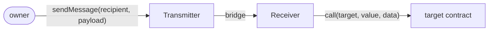
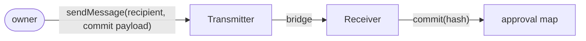
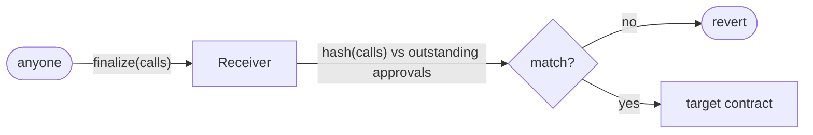
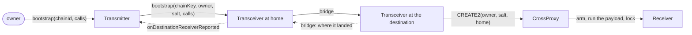

# Message flow

The two paths a message takes, the wire formats, and how the contracts fit together.

**Status.** Both paths are built end to end in-process: `_sendMessage`, `sendMessage` /
`bootstrap`, the quote surface, the inbound funnel, and the reentrancy guard. The send and
receive surfaces are ERC-7786's: `TransmitterBase` is an `IERC7786GatewaySource` and
`ReceiverBase` an `IERC7786Recipient`. Native bindings for LayerZero, CCIP, Hyperlane,
Wormhole, and OP Stack live under `src/protocols/`, tested against mocks of each provider;
nothing has crossed a real bridge yet. What a binding must implement is in
[`provider-spec.md`](provider-spec.md).

**Where the reasoning lives.** Each design decision is argued in the contract that
implements it. This file says what the pieces are and how they connect; for why any of it
is shaped the way it is, read the NatSpec in the file named. Where the two disagree, the
contract is right.

## Three properties the whole design turns on

**The home chain is a property of the account.** Any chain can be home: an owner picks one
per account by calling `createTransmitter` there, and it is part of the account's address.
Every chain runs one transceiver per provider, which creates transmitters for accounts homed
on its chain and receivers for accounts homed elsewhere. Everything below reads "home" and
"destination" rather than "Ethereum" and "elsewhere" for that reason.

1. **A transmitter is its own message-provider endpoint.** It sends to its receiver
   directly, so the transceiver is not in the path of a normal message.
2. **The wire carries a payload, not a commitment.** A message is a call array, executed on
   arrival.
3. **Committing is a call, not a message kind.** A transmitter that wants approve-now and
   run-later sends a payload whose single element calls the receiver's own `commit`. A
   payload carries no message-type tag; only transceiver envelopes carry a kind.

The transceiver has exactly two jobs: standing up a receiver on a chain that has none, and
reporting back where it landed.

## The two paths

### A. Normal send: transmitter to its own receiver


```mermaid
flowchart LR
    Owner([owner]) -->|"sendMessage(recipient, payload)"| Tx[Transmitter]
    Tx -->|"bridge"| Rx[Receiver]
    Rx -->|"call(target, value, data)"| Target[target contract]
```

Every check on that path, in the order a message meets them:

- `sendMessage(recipient, payload, attributes)` is `onlyAccountOwner`. The recipient is
  checked against the stored counterpart, not trusted, and the destination must already be
  bootstrapped.
- `recipient` is `<erc7930: chain, receiver>`, the receiver this account recorded for that
  chain, which `recipientOn` returns, and `payload` is `abi.encode(calls)`, both built by the
  caller. The receiver is the account's own address only when both chains use Ethereum's
  CREATE2. The transmitter quotes them in the same call and `_sendMessage`
  hands them to the gateway with exactly that fee, paid from the transmitter's balance.
  Attached `msg.value` only tops the balance up.
- `receiveMessage(receiveId, sender, payload)` is `onlyRole(GATEWAY_ROLE)`, granted at
  arming, and the sender's address must equal `sourceTransmitter`.
- `_onMessage` is `nonReentrant`. It decodes with `Payload.decodeCalls` and `_execute`s
  the array in order, all or nothing.

The peer relationship is exactly 1:1 (one transmitter, one receiver, one chain pair), which
is the shape every provider's peer table already has. That is what lets the transmitter be
its own endpoint. A shared transceiver fanning in from N transmitters would not fit.

**Deferred execution is the same path.** To pin a hash now and run the array later, send a
payload whose one element targets the receiver itself:

```solidity
calls[0] = Call({
    target: address(receiver),
    value:  0,
    data:   abi.encodeCall(ICommitFinalize.commit, (hash))
});
```

It travels the path above and executes on arrival like anything else. What it leaves behind
is an approval rather than a call to somewhere:


```mermaid
flowchart LR
    Owner([owner]) -->|"sendMessage(recipient, commit payload)"| Tx[Transmitter]
    Tx -->|"bridge"| Rx[Receiver]
    Rx -->|"commit(hash)"| Map[approval map]
```

Anyone supplies the matching array afterwards, and pays for it. The receiver hashes what it
was handed and looks for an outstanding approval on that hash, which is what lets the
caller go unchecked:


```mermaid
flowchart LR
    Anyone([anyone]) -->|"finalize(calls)"| Rx[Receiver]
    Rx -->|"hash(calls) vs outstanding approvals"| Check{match?}
    Check -->|"no"| Revert([revert])
    Check -->|"yes"| Target[target contract]
```

Nothing on the wire distinguishes any of this from an ordinary payload, and nothing needs
to.

### B. Bootstrap: no receiver on the destination yet

There is no peer to send to, so the message goes to the one contract that already exists on
that chain.


```mermaid
flowchart LR
    Owner([owner]) -->|"bootstrap(chainId, calls)"| Tx[Transmitter]
    Tx -->|"bootstrap(chainKey, owner, salt, calls)"| Home[Transceiver at home]
    Home -->|"bridge"| Dest[Transceiver at the destination]
    Dest -->|"CREATE2(owner, salt, home)"| Proxy[CrossProxy]
    Proxy -->|"arm, run the payload, lock"| Rx[Receiver]
    Dest -.->|"bridge: where it landed"| Home
    Home -.->|"onDestinationReceiverReported"| Tx
```

Hop by hop:

- `transmitter.bootstrap(chainId, calls)` is `onlyAccountOwner`, and refuses a destination
  this account has already bootstrapped. It asks its transceiver's `quoteBootstrap` and
  forwards exactly that, bootstrap fee included, from its own balance.
- `bootstrap(chainKey, owner, salt, calls, attributes)` on the home's transceiver:
  `msg.sender` must BE the account homed there, `_requireRoutable(chainKey)` applies the
  registry's grade, the suspension flag, and the provenance bar, and
  `_sendMessage(_recipientOn(chainKey), Envelope.encodeBootstrap(...), attributes)` sends.
- `_onInbound(route, sender, message)` on the destination's transceiver:
  `_authenticateOrigin` runs first, mapping the route to a chain and requiring the sender to
  be that chain's counterpart; `_handleInbound` decodes and calls `_bootstrapInbound(owner,
  salt, origin, transmitter, calls)`, with `origin` the chain `_authenticateOrigin`
  established, which becomes the account's home. Creation and the payload happen in this
  delivery: a bootstrap is never deferred.
- That deploys `CrossProxy` at `accountSalt(owner, salt, origin)`, by CREATE2 with no
  constructor arguments, and calls `upgradeInitializeAndLock(receiverImpl,
  initialize(transmitter, calls))`, which installs the logic, executes the calls, and drops
  the upgrade key in one call. From a home graded `Derived` the receiver must sit at the
  carried transmitter's address, or the bootstrap reverts `ParityBroken`: an origin whose
  provider id, route, or transceiver address disagree with this chain's fails its first
  bootstrap rather than every account.
- The dashed return leg is `_reportReceiver(origin, owner, salt, receiver)`, sent only where
  `addressesDiverge` is set. It arrives at the home's `_handleInbound`, which passes it to
  `_onDestinationReceiver` and on to the account's own counterpart slot, not the registry.

Four facts about that path are worth stating here, because no single file holds all of
them:

**The message carries the owner, their salt, and the transmitter.** The account's own address
derives from the owner, the salt, and the home, and a CREATE2 address cannot be derived from
itself. The receiver's peer is the transmitter's address at home, carried as a 32-byte word
(an EVM address left-padded). The home's transceiver sends only for the account `(owner, salt)`
resolves to there, so the authenticated message vouches for it and the destination needs no
other chain's address formula. That is what lets zkSync and Tron be homes. Where both chains
use Ethereum's CREATE2 it is also the receiver's own address; on zkSync and Tron it is not.

**The return leg is sent by the destination's transceiver.** The receiver cannot be its own
sender: it is not an `OutboundBase` and has no `_sendMessage`. The transceiver holds
everything the report needs at once: the route and counterpart for the home, the
authenticated `(owner, salt)` pair, and the receiver it just created.

**`addressesDiverge` decides whether the report fires.** Where Ethereum's CREATE2 formula
holds, the home computed the receiver's address before the first message left, so a report
would spend a message to restate a derivation it already has. The flag is fixed by the
contract: false on a plain transceiver, true on the zkSync and Tron variants.
`TransceiverBase._bootstrapInbound` argues the rest.

**A failed report takes the account creation with it.** The send is nested inside the
delivery callback, where `msg.value` is zero, so a diverging transceiver pays from its float
and an underfunded one reverts. That is the correct shape, not something to catch: creating
the account anyway would leave the home permanently unable to address it, since `CrossProxy`
arms exactly once and there is no second bootstrap to carry a second report. All or nothing
keeps the operation retryable once the float is funded.

On an EVM destination nothing persists past the transaction: deploy, arm, execute, and lock
all happen in the inbound handler. Chains where deployment is not synchronous (Starknet, the
Move chains) need somewhere to hold the payload in between, which is a per-VM concern.

After this, every subsequent message takes path A and the transceiver is not involved again.
Nothing has to be pointed anywhere: the transmitter's peer is the receiver address its
transceiver predicted at bootstrap, which is its own address wherever both chains use
Ethereum's CREATE2, so it is derived rather than configured. The
exception is LayerZero, which delivers to a peer the OApp stores: the owner records it once
per destination with `setPeer`, and it cannot be changed after.

## Wire formats

An account's channel carries exactly one shape, so its payload needs no tag. A transceiver's
envelope leads with its kind (`Envelope.BOOTSTRAP` 1, `BOOTSTRAP_ELEMENTS` 2,
`RECEIVER_REPORT` 3), and each decoder refuses a kind it does not act on before reading the
rest, so a wrong shape is refused by name rather than misread. Kinds start at 1, so an
untagged body, which leads with the owner, is refused too. A recipient is a binary
interoperable address (ERC-7930) carrying its own chain, so no channel names a destination
separately from its message.

| Channel | Payload |
| --- | --- |
| transmitter → receiver | `abi.encode(Call[] calls)` on EVM, `abi.encode(bytes[] elements)` elsewhere |
| home → destination transceiver | `abi.encode(uint8 1, address owner, bytes32 salt, bytes32 transmitter, Call[] calls)` on EVM, `abi.encode(uint8 2, address owner, bytes32 salt, bytes32 transmitter, bytes[] elements)` elsewhere |
| destination → home transceiver | `abi.encode(uint8 3, address owner, bytes32 salt, bytes interop)` |

**Both transceiver channels identify the account by owner and salt rather than by its
address.** A transceiver is shared by every owner, so nothing the bridge reports says who
authorized the message. The pair rather than the address, because the address is a
derivation of it. That is also what lets the home find the reporting account without a
request id. A bootstrap also carries the transmitter's address, as the receiver's peer rather than as
the account's identity.

A call is `(address target, uint256 value, bytes data)`: the tuple ERC-7579 and ERC-7821
use, so payload-building tooling that already speaks those formats works without custom
code. Which form a destination receives follows from its chain type; see
[`encoding.md`](encoding.md).

A bare commit costs 320 bytes encoded this way, against 32 for the hash it carries. That is
ABI padding and offsets, not information. It amortizes across payloads with real calldata
in them, and it is not worth packed encoding to avoid.

**Non-EVM destinations keep their own call format.** The container is uniform; the elements
are whatever that VM means by a call. Only the receiver on that chain decodes them, and
`hashCalls` folds in the destination chainKey, so the format is already namespaced per
destination. Value is an EVM-ism and does not survive the trip: every other VM moves native
currency as an explicit asset.

## The contracts

Who inherits what:

```
Roles           ← OutboundBase, ReceiverBase
Executor        ← TransmitterBase, ReceiverBase
ReentrancyGuard ← ReceiverBase

OutboundBase                  → TransmitterBase          the home account
                                ReceiverBase             the destination account
OutboundBase                  → TransceiverBase          → DivergentTransceiver
                                                              → ZkSyncTransceiver / TronTransceiver
```

`TransceiverBase` is the only contract with both a send side and a receive side, and its
receive side is `_onInbound` alone: it decodes an `Envelope` and runs no payload of its own.
A transmitter sends and executes locally but never receives over the wire. A receiver
receives and never sends. The guard is `ReentrancyGuardUpgradeable` and covers `_onMessage`, both
`finalize` overloads, and `execute` under one lock.

| Contract | What it is | Public surface |
| --- | --- | --- |
| `messaging/Roles.sol` | `GATEWAY_ROLE` only: which transport may carry a contract's messages, in both directions. Not an authority. `grantRole` is `onlyInitializing`, so membership arrives while a contract is armed and never afterwards. | `hasRole`, `getRoleMembers` |
| `messaging/Executor.sol` | The shared execution loop. In order, all or nothing, reverting with `CallFailed(index, reason)`. | `isAllowed(address, bytes4)`, open by default |
| `messaging/outbound/OutboundBase.sol` | The sending half. No storage and no opinion about who may send. | `quoteMessage`, `routeFor`, `chainKeyOfRoute`, `hasRoute`, `counterpartOn`, `hasCounterpart`, `routeTo` |
| `messaging/outbound/TransmitterBase.sol` | The per-user account on its home chain. One transmitter fans out to every chain. | `sendMessage`, `execute`, `bootstrap` / `bootstrapTo` (three overloads), the matching quotes, `recipientOn`, `chainIdentifierFor`, `payloadForCalls`, `payloadForElements`, `commitmentCall`, `cancellationCall`, `commitmentFor`, `commitmentForChain`, `isBootstrapped`, `isReachable`, `destinationReceiverOn`, `onDestinationReceiverReported` |
| `messaging/inbound/ReceiverBase.sol` | The destination-side account. One per transmitter per destination, reused for every payload. Not an `OutboundBase`: a receiver never sends. | `initialize`, `receiveMessage`, `commit`, `cancel(bytes32)`, `finalize(Call[])`, `finalize(Call[][])`, `execute`, `revokeGateway`, `outstanding`, `isCommitted`, `commitments`, `pendingCount`, `isSourceTransmitter`, `isAuthorizedCaller`, `receive()` |
| `messaging/transceiver/TransceiverBase.sol` | One transceiver per chain per provider, at one address on every standard EVM chain. It creates transmitters for accounts homed here and receivers for accounts homed on any authenticated origin, sends and accepts both bootstraps and receiver reports, applies the registry's grade and suspension to every chain it talks to, and refuses a receiver off its transmitter's address when that home is `Derived` (`ParityBroken`). Owned by the msig's own account on this chain; holds the report float. Locks upgrades in its initializer. | `accountSalt`, `predictCrossAccount`, `predictReceiver`, `createTransmitter`, `predictTransmitter`, `bootstrap`, `bootstrapElements`, `quoteBootstrap`, `quoteBootstrapElements`, `setRoute`, `setRouting`, `setCounterpart`, `resolveCounterpart`, `setBootstrapFee`, `reportsReceiver`, `destinationReceiverOn`, `reportPayload`, `withdraw`, `receive()`, `receiverImplementation`, `transmitterImplementation`, `addressesDiverge`, `CROSS_PROXY_INIT_CODE_HASH` |
| `messaging/transceiver/DivergentTransceiver.sol` | The transceiver on zkSync and Tron. Always reports its receivers, derives its owner with its own formula, and takes its default counterpart on a parity chain from the registry's record of its provider's deployment. | as `TransceiverBase`, plus `accountBytecodeHash` |
| `messaging/transceiver/DivergentAccounts.sol` | The zkSync and Tron account formulas and the write-once bytecode hash. A mixin with helpers rather than a `TransceiverBase`, to stay out of a diamond. | `accountBytecodeHash` |
| `messaging/Envelope.sol` | The two transceiver channels, each body led by its kind. `kindOf`, `encodeBootstrap` / `decodeBootstrap`, `encodeBootstrapElements`, `encodeReceiverReport` / `decodeReceiverReport`; each decoder refuses any other kind. There is no `decodeBootstrapElements`, because only a non-EVM chain receives one. No commitment envelope: committing is folded into the call array. | library, `internal` |

### Facts that span contracts

These are the ones you cannot get by reading a single file.

**`isBootstrapped` and `isReachable` are two facts, and they come apart exactly on the
chains that report.** The first says a bootstrap was dispatched; the second says the
receiver's address is known. Where the address is pre-deterministic they agree from the
first transaction. On zkSync, Tron, and every non-EVM VM nothing is recorded until
`onDestinationReceiverReported` arrives. The account asks its transceiver which case it is
in, through `IAccountTransceiver.reportsReceiver`, because derivability is a property of the
chain and an account holds no registry.

**One role covers both directions.** A contract accepting deliveries from one address while
sending through another would trust two transports and authenticate against one, and nothing
would say so. `ReceiverBase` inherits `Roles` directly rather than through `OutboundBase`,
because a receiver never sends yet has the strictest need to know which gateway is real.

**Only an account holds approvals.** `ReceiverBase` gates `commit`, `cancel`, and `execute`
on its source transmitter or a payload it is already executing. A transceiver holds no
approval map: a bootstrap creates the receiver and runs
its payload in one delivery, so there is nothing to approve. A first payload that should wait
carries a call to the new receiver's own `commit`.

**A transceiver runs no payload.** `Executor.isAllowed` defaults to true on an account. A
transceiver has no `_execute`, so an authenticated counterpart can make it do exactly what
`_handleInbound` does with an `Envelope` and nothing else.

**`finalize` is permissionless; `commit`, `cancel`, and `execute` are gated.** Exactly one
of "the payload is checked" or "the caller is checked" holds, and each entry point picks a
different one.

**Provenance is two useful values and a null.** `Derived` means this chain can recompute an
address on that one. `Attested` means it cannot and was told, so the value is worth exactly
the bridge that carried it. `Unresolved` means nothing has been declared and no bar accepts
it. The order is the semantics, so inserting a grade would renumber the rest.

The addressing, derivation, and registry trees are not covered here. See
[`encoding.md`](encoding.md) for the commitment layer and `registry/ChainRegistry.sol` for
the directory.

## Failure handling

Execution runs inside the bridge callback, so a reverting payload fails the message rather
than stranding a commitment. Every provider lets anyone re-execute a failed message, so this
is a retry rather than a loss. A payload that failed for a fixable reason (insufficient
balance, a target not yet deployed) succeeds on retry once the cause is fixed.

**This holds only under unordered delivery.** It is the default everywhere. Opting into
ordered execution would let one permanently-failing message block every message behind it on
that lane.

**And it holds only because the payload is all-or-nothing.** `_execute` reverts the whole
array on one failure, so a retry re-runs a payload that did nothing rather than re-applying
a prefix that already landed.

**Replay protection on path A is the transport's, not this protocol's.** An
execute-on-arrival payload carries no commitment and no identifier, so a second delivery
would run it twice. Bootstrap and the receiver report are structurally single-shot and need
nothing. Every provider currently in scope except Wormhole's core layer guarantees
exactly-once at the transport, by the same shape that gives retry: mark the message
consumed, then call the receiver with a plain external call, so a revert rolls the mark
back. It is an imported guarantee rather than an enforced one, which is why it is a stated
provider prerequisite and a compliance test rather than a comment. See
[`provider-research.md`](provider-research.md#1-what-each-transport-guarantees-about-replay).

No fallback storage, and no payload size cap: the provider enforces the latter.

## Invariants

- `Commitment.hashCalls` folds in the destination chainKey; `finalize` recomputes with
  `ChainKey.local()`. That is the cross-chain replay protection.
- Target and value sit inside the committed element, so an approval covers who is called and
  how much they receive.
- `finalize` is permissionless; `execute` is gated. Exactly one of "the payload is checked"
  or "the caller is checked" holds, and each entry point picks a different one.
- Account addresses are CREATE2 on `(owner, salt, homeChainKey)`, fixed for the life of the
  protocol and pinnable in a signed payload. Each account has one address on every parity
  chain; the same owner and salt homed on two chains are two accounts.
- Approvals are an unordered map of hash to outstanding count. Nothing has a position, so
  nothing can block.
- Provenance gates bootstrap, the first message to a chain, rather than every send.
- A destination is bootstrapped exactly once per account, and a send to one that has not
  been is refused locally rather than paid for and failed on arrival.

## TODO

Kept in [`todo.md`](todo.md), together with everything else outstanding, so there is one
list rather than three that drift.
