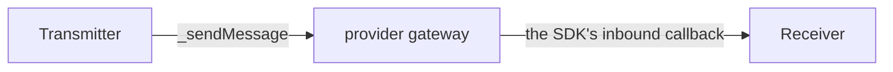
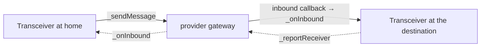

# Message provider compliance

What a message provider binding must implement to be a fully supported transport for this
protocol, and what the provider protocol itself must be capable of before a binding is
worth writing.

[`message-flow.md`](message-flow.md) describes the two paths and
[`encoding.md`](encoding.md) the payload formats. This file is the contract between those
designs and a transport: everything a binding MUST satisfy, everything it MUST NOT do, and
the fixed set of tests that decide whether it did.

**This file is normative, and only that.** Everything in it is a requirement on a binding
or on the provider behind one, checkable against this repository. What we know about
transports we do not control, and about standards that are still drafts, lives in
[`provider-research.md`](provider-research.md). That file goes stale when somebody else
ships a release, not when this protocol changes. Keeping the two apart is what stops the
staleness sitting inside a document people read as a specification. Findings
there that produced obligations are cited from the rules here.

**The core contracts speak ERC-7786 directly.** `TransmitterBase` is an
`IERC7786GatewaySource` and `ReceiverBase` an `IERC7786Recipient`, so a binding attaches a
GATEWAY rather than translating a bespoke send. That narrows what a binding is, and several
rules below narrowed with it;
[the research half](provider-research.md#3-erc-7786-as-a-transport) records what the
standard gives up in exchange.

Nothing here is LayerZero-specific. LayerZero is used for worked examples because it is the
first binding, and its findings are recorded in
[`provider-research.md`](provider-research.md#8-layerzero-as-a-native-binding).

Keywords MUST, MUST NOT, SHOULD and MAY are used in the RFC 2119 sense.

## Contents

| | |
| --- | --- |
| [1. Terms](#1-terms) | what a provider, a binding, an account, a route and a counterpart are |
| [2. Provider prerequisites](#2-provider-prerequisites-the-go-or-no-go-checklist) | P1-P15, the go or no-go checklist, before any code |
| [3. The contract set](#3-the-contract-set) | the files a binding is |
| [4. The seams](#4-the-seams) | every abstract member to answer, and where |
| [5. Normative rules](#5-normative-rules) | R1 send, R2 quote, R3 receive, R4 byte forms, R5 codec, R6 init, R7 fees, R8 parity, R9 write-once |
| [6. Configuration](#6-configuration-a-compliant-deployment-performs) | the deployment, in order |
| [7. Prohibitions](#7-prohibitions) | the thirteen individually tempting mistakes |
| [8. The compliance suite](#8-the-compliance-suite) | C1-C31, and which four would otherwise be found in production |
| [9. Worked skeleton](#9-worked-skeleton-an-erc-7786-gateway-binding) | a gateway binding, abbreviated to the compliance-relevant lines |
| [10. Checklist](#10-checklist) | every line true, and the binding is done |

---

## 1. Terms

| Term | Meaning |
| --- | --- |
| **provider** | The third-party transport: LayerZero, CCIP, Hyperlane, Wormhole, OP Stack. |
| **binding** | The contracts in this repo that attach a provider to the protocol. |
| **account** | A `CrossProxy` at `keccak256(abi.encode(owner, salt, homeChainKey))`: a transmitter at home, a receiver everywhere else. One address on every parity chain. |
| **transceiver** | The shared contract, one per provider per chain, owned by the governor's own account there. It creates transmitters for accounts homed on its chain and receivers for accounts homed elsewhere. |
| **home** | The chain an account was created on, chosen by its owner. Part of the account's address, and authenticated as the origin of its bootstrap. |
| **route** | A chain's canonical ERC-7930 chain identifier, stored per chainKey by `setRoute`. A provider's own name for the chain (an eid, a selector, a domain) is a separate provider id, in `ProviderChainId`. |
| **counterpart** | The address of the transceiver on the other chain, in that chain's own format. |
| **chainKey** | `keccak256(canonical ERC-7930 chain identifier)`. The protocol's only chain name. |

**Two channels, and both are the binding's responsibility.**

- **Path A**, the steady state: account to its own account, direct. The transceiver is not
  in this path. Every account is therefore its own provider endpoint.
- **Path B**, bootstrap: the home's transceiver to the destination's, once per (account,
  chain), plus the destination's report back where it diverges. The transceiver is the
  endpoint here.

That is why a binding is three concrete contracts and not one adapter: the endpoint role
lands on the transmitter, the receiver, and the transceiver independently.

---

## 2. Provider prerequisites: the go or no-go checklist

Before any code is written, the provider must be able to do all fifteen of these. A "no" on
any of P1 through P10 disqualifies the provider outright; P11 through P14 are costs rather
than blockers, and each has a stated fallback. P15 is not about the provider at all: it is a
per-destination check, and a chain that fails it is one this protocol cannot stand an
account up on however good the transport is.

| # | Requirement | Why the protocol needs it |
| --- | --- | --- |
| **P1** | Carry an arbitrary `bytes` body, sender-chosen, no schema imposed | `_sendMessage` is the only send primitive and it carries `bytes`. Payloads, bootstrap envelopes, and reports all use it. |
| **P2** | Any contract may be its own endpoint, permissionlessly | Path A is account to account. If receiving requires provider governance to whitelist an address, every user's account needs an approval and the protocol does not work. |
| **P3** | Deliver to an address the sender chose, not one the provider assigns | The account address is fixed by CREATE2 before the account exists. A provider that mints or assigns the destination address breaks address parity, which is the whole product. |
| **P4** | Report the source chain and source address to the receiving contract | `_onInbound(route, sender, message)` cannot authenticate without both. A provider that reports only "some peer" is not authenticable at our layer. |
| **P5** | Unordered delivery | Ordered lanes turn one permanently-failing message into a halt on that lane. See [Failure handling](message-flow.md#failure-handling). |
| **P6** | Permissionless retry of a failed message | Execution runs inside the delivery callback, so a revert must be a retry and not a loss. |
| **P7** | **Exactly-once execution of a message that succeeded** | Path A runs a call array on arrival with no commitment, no nonce, and no id of its own, so a second delivery would run the payload a second time. Nothing in this repo prevents that, and the transport is the only layer that can. It composes with P6 rather than fighting it: mark consumed, then call the receiver with a plain external call, so a success is terminal and a revert rolls the mark back. See [R3.5](#r3-receive) and [the research half](provider-research.md#1-what-each-transport-guarantees-about-replay). |
| **P8** | Fee payable at source in native currency, from `msg.value` | Signers transact only at home. A provider requiring a fee token per chain reintroduces the funding matrix the protocol exists to remove. |
| **P9** | **Quote that fee at source, as a `view`, on-chain** | The fee is not knowable off-chain from first principles: it depends on payload length, destination gas, and the provider's own price feed. The transmitter prices every send and bootstrap in the same call and pays exactly the answer, so a provider without an on-chain quote cannot be sent through at all. See [R2](#r2-quote). |
| **P10** | No deployment-time registration that changes an address | Anything requiring the account to be deployed by a provider factory, or to hold a provider-issued id in its initcode, moves the address and breaks parity. Implementation-level immutables are fine: they never reach `CrossProxy`'s initcode. |
| **P11** | Send from inside a delivery callback, funded from contract balance | A diverging transceiver's receiver report is sent from inside the bootstrap callback where `msg.value` is zero. Fallback: the report is sent in a separate transaction by a relayer, which weakens the bootstrap to two steps. |
| **P12** | Per-message destination gas or execution options | Carried as ERC-7786 `attributes`. Fallback: the binding hard-codes a default and payloads above it fail on arrival. |
| **P13** | Support for the target chain set, including the non-EVM ones in scope | A provider that reaches only EVM chains is usable, but the Move, Solana, and Starknet work in [`todo.md`](todo.md#4-post-launch-non-evm-destinations) stays blocked on a second provider. |
| **P14** | An upgradeable-safe SDK: namespaced storage, no constructor-only state on the proxy | Accounts are proxies and transceivers are proxies. An SDK that stores in sequential slots forces a layout freeze on every contract it mixes into. |
| **P15** | **Every destination chain permits contract creation by an arbitrary `tx.origin`** | Not a property of the provider but of the chain, and it is P2 one layer down. An account is created inside the inbound delivery callback, so the origin is the provider's relayer, not us and not the owner. A chain that gates creation on an allowlist therefore makes bootstrap work only for allowlisted relayers and takes [P6](#2-provider-prerequisites-the-go-or-no-go-checklist)'s permissionless retry with it. Path A is unaffected, since a send creates nothing. Verified live on two LayerZero destinations, DFK Chain and Dexalot, where the provider's own executor key holds no deploy role and bootstrap therefore cannot happen at all: see [the research half](provider-research.md#chain-level-deployment-permissioning-which-breaks-bootstrap-and-not-sends). Check it per destination by reading the allowlist for the RELAYER'S SIGNING KEY, not for any contract. |

**Prefer a provider's native SDK over its ERC-7786 gateway, where it offers both.** A
gateway satisfies P1 through P4 cleanly and would be less code. But ERC-7786 defines no
quote at all, so P9 fails outright and the whole quote surface goes dead for that binding.
See [the research half](provider-research.md#3-erc-7786-as-a-transport) for how a 7786 binding would map and what
else it gives up.

**P2 and P3 together are the real filter.** They are what "an account is its own endpoint"
means, and they are the claim the entire redesign rests on. Verify them against the
provider's actual code, not its documentation, before writing anything else.

Every binding here quotes on-chain with a `view`: LayerZero's `endpoint.quote`, CCIP's
`getFee`, Hyperlane's `quoteDispatch`, and for Wormhole Core's `messageFee` plus the Executor
quoter router's `quoteExecution`. OP Stack's quote is zero: a deposit is paid in burned gas,
not value.

---

## 3. The contract set

A binding is a handful of files under `src/protocols/<provider>/`, plus
`<P>DivergentTransceiver.sol` where the provider reaches zkSync or Tron.

| File | Extends | Role |
| --- | --- | --- |
| `<P>Message.sol` | library | The shared send, quote, and attribute code, called by the transmitter and the transceiver. Where the SDK is inherited and already sends (LayerZero's OApp), it holds only the attribute. |
| `<P>Transmitter.sol` | `OwnableTransmitter` (`TransmitterBase` + `OwnableUpgradeable`) | The per-user account at home. Sends on path A. |
| `<P>Receiver.sol` | `ReceiverBase` | The per-user account on every other chain. Receives on path A. |
| `<P>Transceiver.sol` | `ProviderTransceiver` (`TransceiverBase` + `ProviderChainId`) | Both ends of path B: sends bootstraps and reports, receives both. The provider's wiring is an abstract `<P>TransceiverBase` in the same file, which the plain `<P>Transceiver` and the zkSync/Tron variants share. `ProviderTransceiver` only where a provider-native chain id survives; for `op-stack-l1-l2` the id is the address of the messenger that reaches the chain, and under ERC-7786 a gateway binding has no id at all. See [§9](#9-worked-skeleton-an-erc-7786-gateway-binding). |
| `<P>DivergentTransceiver.sol` | `ZkSyncTransceiver` or `TronTransceiver`, beside `<P>TransceiverBase` | The same transceiver on zkSync or Tron, which derive account addresses their own way. Each override only names both bases. |

Where the provider sits, on each path. Path A carries every ordinary message and touches
only the two accounts:



Path B runs once per chain, between the home's transceiver and the destination's, with the
report coming back only where `addressesDiverge` is set:



Three contracts, one gateway, and the same two seams on every one of them: `_sendMessage`
outbound and the SDK's callback inbound.

**`<P>Message` is not optional structure, it is the deduplication that keeps them in
agreement.** Fee handling, attribute decoding, the recipient byte form, and the sender byte
form must be identical across the transmitter and the transceiver. Otherwise authentication
silently diverges between path A and path B, and a quote stops predicting its own send.
Writing them once is what makes that structural. It declares no storage of its own, except
where it owns replay (R3.5), in an ERC-7201 slot.

---

## 4. The seams

Every abstract or virtual member a binding must answer, and where.

### 4.1 Required on all three contracts

The receiver does not inherit `OutboundBase` and never sends, so the first two rows bind
the transmitter and the transceiver.

| Seam | Declared in | Obligation |
| --- | --- | --- |
| `_sendMessage(bytes recipient, bytes payload, bytes[] attributes, uint256 value)` | `OutboundBase` | MUST override, returning zero once the provider has the message ([R1](#r1-send)), and MUST pay the provider from `value` rather than from `msg.value`. There is no default: a contract that omits it does not compile. See [R1](#r1-send) and [R7.1](#r7-fees-and-value). |
| `_quoteMessage(bytes recipient, bytes payload, bytes[] attributes)` | `OutboundBase` | MUST override, `view`, same arguments as the send. There is no default; a provider that cannot quote on-chain overrides it to revert `QuoteNotImplemented`, which also reverts every send, since the entry points price themselves. See [R2](#r2-quote). |
| the provider's inbound callback | the SDK | MUST route into exactly one protocol funnel and nothing else. See [R3](#r3-receive). |

### 4.2 Required on the transmitter

| Seam | Declared in | Obligation |
| --- | --- | --- |
| `_owner()` | `TransmitterBase._owner` | Answer from the SDK's own ownership if it brings one, otherwise from `OwnableUpgradeable`. |
| `_checkOwner()` | `TransmitterBase._checkOwner` | Same. Note `TransmitterBase` uses `onlyAccountOwner`, not `onlyOwner`, precisely so an SDK's `onlyOwner` does not collide. |
| `initialize(address owner, address transceiver, bytes32 salt)` | `ITransmitterInit`, in `TransceiverBase.sol` | MUST exist with that exact signature, or the transceiver's `_accountInitializer` MUST be overridden to encode a different one. |

### 4.3 Required on the receiver

| Seam | Declared in | Obligation |
| --- | --- | --- |
| `initialize(...)` | `IReceiverInit`, in `ReceiverBase.sol` | Declare a binding-specific one, do provider setup, then call `__ReceiverBase_init` LAST so the bootstrap payload runs against a configured provider. Never `super.initialize`; see below. |
| an owner or delegate | none today | If the SDK needs an owner-gated config surface on the account, the receiver's initializer MUST carry the owner. `_accountInitializer` is `virtual` on the transceiver for exactly this. |
| nothing else | | A binding MUST NOT expect the transceiver to reach a receiver after creation. `commit`, `cancel`, and `execute` are gated on the transmitter alone; the initializer is the transceiver's only call, ever. |

### 4.4 Required on the transceiver

| Seam | Declared in | Obligation |
| --- | --- | --- |
| nothing for authority | `OwnableUpgradeable`, via `TransceiverBase` | There is no seam to answer. The owner is derived in `__TransceiverBase_init` from the config's governor owner, salt, and home: the governor's own account on this chain. A binding MUST NOT bring a SECOND ownership implementation: an SDK using OpenZeppelin's own `OwnableUpgradeable` shares this one, which is correct, but two different systems over the same operations would mean an authority gated on one is exercisable through the other. |
| nothing for the roles | `Roles.grantRole` | Named in the config's `gateways`, or granted inside the initializer with `grantRole(GATEWAY_ROLE, endpoint)`, which is `onlyInitializing`; `ProviderTransceiver.__ProviderTransceiver_init` does it for the provider's own endpoint. A binding MUST NOT add a grant path and MUST NOT expect one: after the arming call no caller of any kind can add a member. |
| `initialize(TransceiverConfig)` | convention | MUST call `__TransceiverBase_init(c)`, or `__DivergentTransceiver_init(c, hash)` on zkSync and Tron. The config carries the gateways, both account implementations, the governor's owner, salt, and home, and the chain's treasury. |
| `addressesDiverge` | not an argument | A binding MUST NOT take it from the caller. It has to agree with `predictCrossAccount`, so the plain init stores false and the divergent init true, alongside the account bytecode hash its compiler produces. See `LzTransceiver` against `LzZkSyncTransceiver`. |
| `_accountInitializer(owner, salt, homeChainKey, sourceTransmitter, calls)` | `TransceiverBase._accountInitializer` | Override to fold provider setup into the transmitter's or receiver's initializer, and to carry the owner if the SDK needs one. `sourceTransmitter` is the address the bootstrap carried, which the receiver must authenticate. There is no second chance: `CrossProxy` locks in the same call that arms it. |
| the provider id table | `ProviderChainId`, via `ProviderTransceiver` | A typed setter (`setEid`, `setSelector`, `setDomain`, `setWormholeChain`) over `_setProviderId`, write-once. The inbound callback maps the delivery's origin id back to a route with `_onProviderInbound`, so an unmapped origin reverts and a mapped one goes through the base's counterpart check. |
| nothing for routing | | The base's `setRoute(chainKey, identifier)` is already typed for what a route now holds, and `routeFor` / `chainKeyOfRoute` / `hasRoute` / `routeTo` are the reads. |
| the receiver report | `_reportReceiver`, in the base | Nothing to override. The base sends it from `_bootstrapInbound` when `addressesDiverge` is set, through the same `_sendMessage` the binding already implements. What a binding owes it is [R7.3](#r7-fees-and-value): the nested send is funded from the transceiver's float. |

**Why the receiver's initializer is the shape it is.** `__ReceiverBase_init` is
`internal onlyInitializing` and the external `initialize` is a thin `initializer` wrapper,
and that is the only arrangement a binding can hook. The three alternatives all fail:

- Calling `super.initialize` first runs the payload against an unconfigured provider, which
  is the ordering the guard exists to prevent.
- Configuring first and then calling it reverts, because the SDK's own `onlyInitializing`
  setup would run while `_initializing` is still false.
- Declaring `initializer` on both reverts `InvalidInitialization`, since a nested
  `initializer` on a contract that already has code is not a valid top-level call.

So: own `initialize`, provider setup, `__ReceiverBase_init` last.

**It also carries the account's owner where the SDK needs one.** A binding whose SDK wants
an owner-gated config surface declares its own initializer signature carrying it and
overrides `TransceiverBase._accountInitializer` to encode that selector. No address
moves: initializer calldata is not in the initcode.

### 4.5 Deliberately absent

A binding MUST NOT expect any of these, and MUST NOT add them.

- **No authentication seam.** `_authenticateOrigin` is answered by
  `TransceiverBase._authenticateOrigin`, not by a binding. This is
  deliberate: a transceiver decides which cross-chain payloads are authentic, and leaving
  that per provider is how one provider ships without it.
- **No message-type seam.** An account's channel carries one shape. Transceiver envelope
  kinds are defined in `Envelope` and checked by the base decoders; a binding passes the
  message through untouched.
- **No registry pointer on an account.** A transmitter holds no registry and knows no
  routes, by design. It resolves through its transceiver: see [R1](#r1-send).
- **No provenance seam.** Grading and suspension are the registry's, applied by the base
  transceiver in `_counterpartOn`.

---

## 5. Normative rules

### R1. Send

`_sendMessage` MUST put `payload` on the wire addressed to `recipient`, and MUST revert if
it cannot. It returns ERC-7786's `sendId`, which is zero once the message is away:
`TransmitterBase.sendMessage` emits `MessageSent` with this value and returns it, and ERC-7786
reads a non-zero id as a further step still owed. A native binding MUST return zero and MUST
NOT return its provider's own message id (LayerZero's guid, CCIP's `messageId`), which stays
in the provider's events; `ProviderSendSpec.test_aCompletedSendReturnsZero` holds this. A
binding over an ERC-7786 gateway returns that gateway's `sendId`, MUST NOT discard a
non-zero one silently, and either performs the second step or refuses gateways that need
one, saying which in its NatSpec ([§9](#9-worked-skeleton-an-erc-7786-gateway-binding)).

**R1.1 The recipient arrives built, and the binding MUST NOT re-derive it.** It is a
binary interoperable address naming its own chain, so there is no chain id to resolve and
no route table to consult inside `_sendMessage`. The route table still exists, but it holds
each chain's ERC-7930 IDENTIFIER now rather than a provider's private id, and it is read by
`TransceiverBase._recipientOn` on the way in.

**R1.2** An account MUST NOT hold a route table of its own: a user adding a destination is
a governance configuration change, not a per-account migration. `IAccountTransceiver.routeTo` is
the read, on the transceiver an account already stores.

**R1.2.1** Every `bytes` argument on the account's own surface MUST have a public builder
that produces it, and a binding MUST NOT remove one. `Erc7930` is a library of `internal`
functions, so an integrator cannot reach it. `recipientOn` (for a destination this account
has bootstrapped), `chainIdentifierFor`, `payloadForCalls`, and `payloadForElements` are the
only way to construct these values without reimplementing the encoding. A wrong interoperable address is a message addressed
nowhere, not a revert.

**R1.3** The destination on path A is the counterpart the account recorded for that chain,
which `TransmitterBase` enforces on every recipient, and a binding MUST NOT substitute its
own notion of a peer. Where the SDK insists on a peer table, the binding SHOULD populate it
from `counterpartOn(chainKey)` rather than from `address(this)`: the two agree only where both
this chain and the destination use Ethereum's CREATE2 formula, and differ wherever either is
zkSync or Tron, where deriving the peer names an address that holds no receiver.

**R1.4** The recipient on path B is built by `_recipientOn(chainKey)` from the route and
`_counterpartOn`. A binding MUST NOT assume the address half is 20 bytes without checking
the chain type.

**R1.5** `attributes` are decoded only inside the binding, and an empty array MUST mean
"the gateway's default" rather than zero gas. A binding MUST answer `supportsAttribute`
honestly, and a gateway that refuses an attribute it does not know is behaving correctly.

**R1.6** A send to an unconfigured destination MUST revert, not succeed. `routeFor` reverts
`NoRouteFor` and `_requireBootstrapped` reverts `NotBootstrapped`; a binding that catches
either and falls back is non-compliant.

**R1.7** Path A is reachable only after path B has run for that destination.
`TransmitterBase` refuses a send to a chainKey it has not recorded a bootstrap for, and
refuses a second bootstrap to one it has. A binding inherits both gates and MUST NOT add a
send entry point that bypasses them: the peer address on an un-bootstrapped chain holds no
code, so such a send is a fee spent on a message that cannot be delivered.

### R2. Quote

Every send has a fee, and the fee is not derivable off-chain from first principles: it is a
function of the payload's exact bytes, the destination gas the payload needs, and the
provider's own price feed at that block. The transmitter therefore asks on-chain, in the
same call as the send ([R2.6](#r2-quote)), and the public quotes let a caller size the
balance it pays from ahead of time.

**R2.1 The seam.** `_quoteMessage` MUST be overridden alongside `_sendMessage` and MUST
mirror it exactly:

```solidity
/// @notice What `_sendMessage` would cost, in this chain's native currency.
function _quoteMessage(
    bytes memory recipient,
    bytes memory payload,
    bytes[] memory attributes
) internal view virtual returns (uint256 nativeFee) {
    revert QuoteNotImplemented();
}
```

**R2.2 It MUST be `view`.** A quote that writes state cannot be called from an off-chain
`eth_call` in the same block as the send it prices, which is the only way it is ever used.
A provider whose quote is not `view` fails [P9](#2-provider-prerequisites-the-go-or-no-go-checklist)
and the binding MUST document the fallback rather than making the seam non-view. Making
`_quoteMessage` mutable would force the whole read surface below to be mutable too, and a
`quoteMessage` that cannot be `eth_call`ed is not a quote.

**R2.2.1 A binding MUST NOT try to derive the fee by simulating its own send, and it could
not if it tried.** The idea is the obvious one and it fails for three independent reasons,
recorded here so nobody rediscovers them:

- `STATICCALL` forbids `LOG`, and every send emits. ERC-7786 requires a `MessageSent`
  event and every native SDK logs too, so the simulation reverts at the first log, before
  reaching anything worth reading.
- `STATICCALL` cannot carry value, so a fee-taking send cannot be simulated at all. The
  question becomes "does this succeed with nothing attached", whose answer is always no.
- There is nothing to read even if it ran. A send returns a message id, not a price. It
  CONSUMES `msg.value`; it never computes a number to hand back.

The mutating variant (perform the send, revert with the answer, call it through `eth_call`
so the state change is discarded) is a real pattern and is how Uniswap's quoter works. It
is still refused here. It requires the gateway to reveal the fee somehow, it needs a
balance override to fund the simulation, and it would make the whole read surface above
non-view, which is the property R2.2 exists to protect.

**R2.2.2 Checking a quote is off-chain, and it MEASURES rather than searches.** The
constraints in R2.2.1 are the EVM's static context, and a simulator is not bound by them. A
Foundry fork test or script can call the REAL send against the real endpoint and read the
exact net cost off the paying account's balance:

```solidity
uint256 snap = vm.snapshotState();
vm.deal(address(transmitter), 100 ether);
uint256 before = address(transmitter).balance;

bytes memory recipient = transmitter.recipientOn(destinationChainId);
bytes memory payload = transmitter.payloadForCalls(calls);   // or payloadForElements

vm.prank(owner);
transmitter.sendMessage(recipient, payload, attributes);

uint256 fee = before - address(transmitter).balance;   // charged minus refunded, exactly
vm.revertToState(snap);
```

That is one call and an exact number, not a bound from bisection, because the refund lands
back on `_refundTo()` and the delta is therefore the net. It is how
[C11](#8-the-compliance-suite) checks that a quote equals what the send actually consumes,
and how an operator sizes the float a diverging transceiver needs for its return reports under
[R7.5](#r7-fees-and-value).

It is not a substitute for a missing quote. The transmitter prices each send on-chain
([R2.6](#r2-quote)), so a binding whose `_quoteMessage` reverts `QuoteNotImplemented` can
send nothing, and its provider fails [P9](#2-provider-prerequisites-the-go-or-no-go-checklist).

**R2.3 It MUST price the exact bytes the send would carry.** The quote is taken over
`Payload.encodeCalls(calls)` or `Envelope.encodeBootstrap(owner, salt, transmitter, calls)`, the same
function `sendMessage` puts on the wire, not over an estimate of the length. LayerZero, CCIP,
and Hyperlane price per byte; Wormhole's Executor and OP Stack do not, and the rule costs them
nothing. This is what makes a quote a number the send can pay rather than a number it must
pad, and it is why the public surface below takes exactly `sendMessage`'s arguments.

**R2.4 It MUST use the same route, destination, and options resolution as the send.** Any
divergence between `_quoteMessage` and `_sendMessage` is a quote that prices a different
message than the one that goes out. In practice this means both call one shared internal
helper for recipient construction and one for attribute decoding, which is
[§3](#3-the-contract-set)'s argument for `<P>Message` restated.

**R2.5 It MUST revert exactly where the send would.** An unconfigured route, an
unroutable destination, or a counterpart below the provenance bar MUST fail the quote too.
A quote that succeeds where the send fails tells a caller the operation is ready when it is
not, which is worse than no quote at all.

**R2.6 The entry point consults it; `_sendMessage` MUST NOT.** `sendMessage` and each
bootstrap call the quote in the same call as the send and pay exactly its answer from the
transmitter's balance, reverting `InsufficientBalance` when the balance cannot cover it.
Taken in the same transaction, the price cannot move between quote and send, so a signer
approves a payload and never a price, and `msg.value` only tops the balance up. The cost is
one extra provider read per message. `_sendMessage` stays a plain spend of the `value` it is
handed, so a binding implements the same seam either way. A transceiver's receiver report
prices itself the same way.

**R2.7 It MUST NOT be cached on-chain.** A stored quote is a stale quote.

**R2.8 The native fee MUST be the whole answer.** Where a provider supports paying in its
own token (LayerZero's `lzTokenFee`), the binding MUST quote the native-only path, because
the protocol's funding model is native currency at home. A binding MAY expose a second,
clearly-named function for the token path; the compliance surface below is native.

**The public read surface is one function.** ERC-7786 gives the send a single shape, so the
quote has one too:

```solidity
/// @notice What `sendMessage` would cost, in this chain's native currency.
/// @dev Its arguments are `sendMessage`'s. A caller builds the recipient and the payload
///      once, prices them to fund the account, and sends the same three arguments; the
///      send prices itself again and pays from the account's balance.
function quoteMessage(
    bytes calldata recipient,
    bytes calldata payload,
    bytes[] calldata attributes
) external view returns (uint256 nativeFee);
```

It carries the same gates the send does, for the reason in R2.5: an unbootstrapped
destination and a recipient that is not this account fail here too. It is ungated, unlike
the send, because a signer reviewing a payload, or anyone funding the account for it, has
to be able to call it.

`quoteBootstrap` and `quoteBootstrapTo` keep their `Call[]` and `bytes[]` forms, because
path B's envelope is built by the transceiver rather than handed to it.

**R2.9 The send and quote surfaces are 1:1, and a binding MUST keep them so.**
`sendMessage`/`quoteMessage`, and each of the three bootstraps against its own quote, all
with identical arity. That is R2.3 made structural rather than promised: `attributes`
carries destination gas, which changes the price, so there is no no-attributes send that
would have no quote to price it. A binding MUST NOT add a convenience overload that breaks
the pairing.

**A receiver has no quote and cannot acquire one.** `ReceiverBase` does not inherit
`OutboundBase`, so the absence is structural rather than a gate someone could widen: a
receiver never sends, and pricing a message that has no path is not a thing to expose.

**The payload builders are shared, not duplicated.** Each quote calls the same
`Payload.encodeCalls` / `Payload.encodeElements` / `Envelope.encodeBootstrap` its sending
twin calls. "The quote prices the exact bytes that go out" is therefore a property of there
being one builder, rather than a promise two code paths make separately.

**The transceiver's quote.** `TransceiverBase` MUST expose the path B quote it is asked
for, matching its `bootstrap` and `bootstrapElements` entry points:

```solidity
function quoteBootstrap(
    bytes32 destinationChainKey,
    address owner,
    bytes32 salt,
    Call[] calldata calls,
    bytes[] calldata attributes
) external view returns (uint256 nativeFee);
```

It MUST apply `_requireRoutable` first, exactly as `bootstrap` does, so the provenance bar
is enforced identically on the quote and on the send ([R2.5](#r2-quote)). It MUST NOT
apply `bootstrap`'s `predictCrossAccount(owner, salt, localChainKey) == msg.sender` check: a quote is
taken by a UI or a signer before the account exists, and gating it on being the account
would make it uncallable in exactly the case it is needed. The check protects the send from
standing up somebody else's account, and there is nothing to protect on a `view`.

### R3. Receive

The provider's delivery callback MUST route into exactly one funnel per contract, and MUST
do nothing else with the message.

| Contract | Entry point | Then |
| --- | --- | --- |
| receiver | `receiveMessage(receiveId, sender, payload)` over an ERC-7786 gateway, or the binding's callback | `_onMessageFrom(sender, payload)`, which checks the source transmitter and calls `_onMessage(payload)` |
| transceiver | the binding's callback | `_onInbound(route, sender, message)`, through `_onProviderInbound` where the provider names the origin by its own id |
| transmitter | none | MUST revert |

**R3.0 `ReceiverBase.receiveMessage` is `external`, so it carries its own gate.** Two
checks, and they are not the same check. `onlyRole(GATEWAY_ROLE)` says the message came
through transport this account trusts, which the binding establishes by granting the role.
The sender's address must equal the account's `sourceTransmitter`, which says it came from
THIS account on the other side; that one needs no configuration and is therefore answered in
the base. An honest but shared gateway would otherwise let one account's payload land in
another's receiver.

**R3.0.1 An account MUST be granted its gateway during initialization, and there is no
later chance.** `Roles.grantRole` is `onlyInitializing`, so after the arming call there is
nobody a grant could come from. Not the transceiver that created it, not the governor, and not
the account's own owner. A binding therefore calls `grantRole(GATEWAY_ROLE, endpoint)` from its
own `initialize`, ahead of `__ReceiverBase_init`, where the rest of its provider setup already
goes. The same applies to a transmitter, and to a transceiver, whose gateways normally arrive
in its initializer's `gateways` argument instead.

**R3.0.2 A binding MUST NOT add a grant path, and MUST NOT expect one.** The only membership
change that survives initialization anywhere in this protocol is
`ReceiverBase.revokeGateway`, gated on the source transmitter, and it only subtracts. A
dropped transport cannot be replaced, so the account goes deaf and stays that way. A
transceiver has no equivalent at all, since it is shared by every owner on its chain. A
binding that needs two transports names both while arming.

**R3.1 The transmitter MUST reject inbound messages.** There is no path in which a
transmitter receives. If the SDK's base contract provides a receive entry point, the
binding MUST override it to revert. A transmitter is driven by its owner alone; a receive
path would give a transport a second way to make it act.

**R3.2 The binding MUST NOT authenticate in place of `_onInbound`.** Translating the SDK's
callback into three arguments is the binding's entire inbound job. Any check the binding
performs is additive.

**R3.3 An SDK that authenticates before our code runs is acceptable and MUST be
documented.** LayerZero's `lzReceive` checks `msg.sender == endpoint` and then
`peer[srcEid] == origin.sender` before `_lzReceive` is reached. For a 1:1 pairing there is
nothing extra to verify, so this is defensible, but it contradicts the rule stated in
`TransceiverBase._onInbound` and MUST appear as a written exception in the binding's NatSpec
rather than as an omission. LayerZero is the only binding that takes it (see
[the research half](provider-research.md#8-layerzero-as-a-native-binding)).

**R3.4** The receiver's funnel is `_onMessage`, which is `nonReentrant` and executes on
arrival. The binding MUST NOT decode the payload itself: `Payload.decodeCalls` happens
inside `_onMessage`, so every provider gets the same decoder and the same failure mode.

**R3.5 Replay protection on path A is the transport's, and a binding whose transport does
not provide it MUST supply it.** This is the one protocol-level guarantee that is imported
rather than enforced here. It is worth stating precisely, because it is invisible in this
repo's source.

An execute-on-arrival payload carries no commitment and no identifier, so a second delivery
of the same message runs it again. Bootstrap and the receiver report are both structurally
single-shot and need nothing (`CrossProxy` arms exactly once, `initialize` is single-shot,
and the account refuses a second receiver report), but path A has no such property, and it is the path
every message after the first takes.

Most candidate transports guarantee it, and there the binding does nothing. The exceptions
are the raw signature primitives, Wormhole's core layer and Avalanche's Warp precompile,
which prove a message was authorised and stop there. On either, a binding MUST dedupe inside
`<P>Message` before reaching `_onMessage`, keyed on whatever that transport makes unique
per message: Wormhole's VAA digest, or `(emitterChain, emitterAddress, sequence)`. See [the research half](provider-research.md#1-what-each-transport-guarantees-about-replay)
for what each provider actually does.

**R3.6 The dedupe MUST be per receiving account, not global to the binding.** Accounts are
their own endpoints, so one account's replay record must not be exhaustible by another's
traffic. Every transport that provides this already keys it correctly (LayerZero by
`[receiver][srcEid][sender][nonce]`, Hyperlane by a message id covering the recipient); a
binding supplying its own MUST match that shape.

**R3.7 A binding MUST NOT swallow a failing delivery**, with `try/catch` or otherwise. The
retry property in P6 exists because the mark-consumed write is rolled back by the same
revert that failed the payload. Catching the failure would consume the message and drop the
payload, converting a retry into a loss. `_execute` being all-or-nothing is the other half
of that: a partially applied payload could not be safely retried.

### R4. The byte forms, which are the authentication

This is the rule most likely to be got wrong, and it fails at runtime rather than at
compile time.

**R4.1** The `route` bytes passed to `_onInbound` MUST be byte-identical to what `setRoute`
stored for that chain. `chainKeyOfRoute` keys on `keccak256(route)`, so a one-byte
difference is an `UnknownRoute` revert. The binding MUST produce both directions from the
same codec function. Never hand-encode at one end.

**R4.2** The `sender` bytes MUST be byte-identical to what the counterpart lookup returns.
For an EVM counterpart that is 20 raw bytes: `TransceiverBase.counterpartOn` returns
what `setCounterpart` stored, which is `Erc7930.parseStrict(interop).addr`, and the fallback
returns `abi.encodePacked(_parityAddress(chainKey))`, the transceiver's own address unless it
sits on zkSync or Tron, which derive it from the registry. Both are 20 bytes. A provider reporting a 32-byte
left-padded sender MUST be narrowed by the binding.

```solidity
// WRONG: 32 bytes, will never equal the registry's 20.
bytes memory sender = abi.encode(origin.sender);

// RIGHT: the same 20 raw bytes the registry stores.
bytes memory sender = abi.encodePacked(address(uint160(uint256(origin.sender))));
```

**R4.3** The narrowing MUST reject a non-EVM sender rather than truncate one. A 32-byte
Solana pubkey cast down to 20 bytes is a forgery primitive, not a formatting bug.

**R4.4** The governor home's route is given at initialization as a chain identifier, and
the initializer refuses one that is not the canonical form of its key (`RouteKeyMismatch`):
it names the home the owner is derived for, so a wrong one makes a transceiver nobody owns.

### R5. The route codec

**R5.1** A route is the chain's canonical ERC-7930 chain identifier, and `setRoute` refuses
any other form of it (`RouteKeyMismatch`). A binding that keeps a provider-native value in
`bytes` of its own MUST encode it with fixed-width `abi.encode`, never `encodePacked`, so a
value at the wrong width fails loudly in `abi.decode` rather than silently reinterpreting.
Provider ids need none of this: `ProviderChainId` stores them as `uint256` (R5.3).

**R5.2** The provider's native type MUST appear only in the binding's own files: the
transceiver's typed setter and initializer argument over `ProviderChainId`, and an SDK peer
entry. It MUST NOT appear in any base contract or in the registry.

**R5.3** `ProviderChainId` stores ids as `uint256`, write-once and injective both ways. The
typed setter bounds an id on the way in; readers get `uint256` from `providerIdFor` and
narrow it to the provider's type themselves.

### R6. Account initialization

**R6.1** Everything the provider needs configured on an account MUST be folded into
`_accountInitializer`. A transceiver has no authority over an account after creating it:
`CrossProxy` upgrades, initializes, and zeroes its own admin in one call, and the account's
own configuration is gated on its owner, which the transceiver is not.

**R6.2** The initializer MUST configure the provider before the bootstrap payload runs. A
payload can itself send, and it can call arbitrary targets.

**R6.3** `__ReceiverBase_init` initializes the reentrancy guard before it runs the payload. A
proxy runs no constructor, so the guard is uninitialized until then, and a binding's provider
setup, which runs earlier, MUST NOT call back into the account.

**R6.4 Any provider-side authority over an account MUST be the account itself.** Where an
SDK takes a delegate, an owner, or a configurator at initialization, the binding passes
`address(this)`, which inside `upgradeInitializeAndLock`'s delegatecall is the account. It
MUST NOT be the transceiver, the governor, or an operator.

The account locks in the same call that arms it and its own configuration is owner-gated, so
any address named here is an authority nobody can revoke and the account cannot override.
Naming the transceiver would hand the contract that authenticates every inbound message a
standing power to reconfigure every account it created, which is the arrangement
`ReceiverBase.isAuthorizedCaller` refuses one level up. Naming the account costs nothing:
an account that needs to change its own provider configuration can, because a payload it
executes runs as itself.

**R6.5** A binding SHOULD account for the per-account provider cost and state it.
LayerZero's `__OAppCore_init` calls `endpoint.setDelegate`, so every account creation
touches the endpoint. That is real gas on the bootstrap path and the concrete form of
"peers and send-side security configuration are per-user rather than shared". It is also a
cost the bootstrap quote must include, which is [R2.3](#r2-quote) applied to path B.

### R7. Fees and value

**R7.1 The binding is told how much it may spend, and MUST NOT read `msg.value`.**
`_sendMessage` takes the amount as its fourth argument, and that is the number to pay the
provider. It is never `msg.value`: on a transmitter it is the quote and `msg.value` only
tops up the balance, the transceiver takes its bootstrap fee off the top, and on a nested send
`msg.value` is zero. In every case the payment comes from the sending contract's balance. A
binding reading `msg.value` overpays the provider, or refunds the fee to the sender, or
sends nothing.

**R7.2** Refunding the excess is the binding's job, because only the binding knows the
provider's refund convention. The address it refunds to is NOT the binding's choice: it
MUST be `OutboundBase._refundTo()`, and a binding MUST NOT read a refund address out of the
attributes or substitute one of its own.

The rule is one sentence: a fee is overpaid by whoever paid it, so the remainder goes back
to the party that sent the value. That is the account on both paths. On path A the
transmitter paid from its own balance, so `TransmitterBase` overrides `_refundTo()` to
`address(this)`. On path B the base answers `msg.sender`, and `bootstrap` refuses any
caller that is not `predictCrossAccount(owner, salt, localChainKey)`, so `msg.sender` is the ACCOUNT. The
one exception is a receiver report, which a transceiver pays from its own float inside a
delivery, where `msg.sender` is the relayer: its overpayment returns to that float. A
shared transceiver refunding a bootstrap to `address(this)` would pool every user's excess
into infrastructure with no per-user way out, so it refunds to itself only while it is
sending a report.

Both halves of an account declare `receive`, which on `TransmitterBase` is load-bearing
rather than decorative: a provider's refund is a plain value transfer, and one to a
contract that cannot accept it reverts the send that earned it.

A binding MUST NOT put a refund address in the attributes instead. That leaves
`_sendMessage` with no correct default on a bootstrap, since the owner is inside the encoded
envelope and the binding would have to decode `Envelope` to find it. The refund address is
the one value a binding cannot be handed, which is why it is a function on the base rather
than an argument; the send VALUE is the opposite case, and is passed (see
[R7.1](#r7-fees-and-value)).

**R7.3** A nested send (the receiver report, sent from inside a delivery callback) has
`msg.value == 0` and MUST be funded from the sending contract's balance. A binding whose
provider cannot do this MUST say so and the report path MUST fall back to a separately
funded transaction. Each transceiver's float is funded for it out of band
([§6](#6-configuration-a-compliant-deployment-performs)).

**R7.4** The transmitter's `bootstrap` forwards exactly the transceiver's `quoteBootstrap`,
from its balance. A binding MUST NOT retain a remainder on the transceiver.

**R7.5** Where the report is sent from a contract balance, the binding SHOULD expose the
report's own quote (`reportPayload` with `quoteMessage`) so an operator can size that
float. A transceiver that runs dry fails every bootstrap on its chain at the return leg, and
the failure is invisible from home until someone finds the account unreachable there.

### R8. Storage and address parity

**R8.1** The binding MUST NOT add constructor arguments to `CrossProxy`. Its initcode is one
constant byte string and every account address on every chain depends on it. Provider state
belongs on the implementation, where an `immutable` never reaches the proxy's initcode. A
per-chain endpoint address is exactly what an implementation-level immutable is for.

**R8.2** The SDK's storage MUST be ERC-7201 namespaced, or the binding MUST pin the
inheritance order and document the resulting layout. The bases use sequential storage with
no gaps, so a binding that appends sequential slots to a base freezes that base's layout.
Accounts and transceivers are upgraded once, onto a blank proxy, and then locked, so no later
version has to match it. `ChainRegistry` has no proxy at all.

**R8.3** The binding MUST NOT change `CROSS_PROXY_INIT_CODE_HASH`, and MUST NOT change
compiler settings. `bytecode_hash = "none"` and `cbor_metadata = false` are pinned in
`foundry.toml` because solc's default trailer carries an IPFS hash of the source, comments
included, which would otherwise put every derived address one comment edit away from moving.

**R8.4** `ChainRegistry.setProviderDeployment`'s `crossProxyInitCodeHash` MUST equal
`TransceiverBase.CROSS_PROXY_INIT_CODE_HASH` as built by solc, and its `deployedBy` MUST be
the account that called `CrossProxyDeployer.deploy` for the provider's transceivers. The
shared deploy asserts this for every binding (`script/deploy/TransceiverDeploy.sol`) rather
than transcribing it. A diverging transceiver predicts its receivers on
parity chains from this record, since its own constant comes from zksolc or TRON-solc.

### R9. Write-once discipline

**R9.1** The binding MUST NOT add a setter for any value the base makes write-once:
`setRoute`, `setCounterpart`, the provider id table, `setRouting`'s registry and provider,
`setProviderDeployment`, a chain's grade, `receiverImplementation`,
`transmitterImplementation`, `treasury`, `addressesDiverge`, a resolved ref slot.

**R9.2** A typed wrapper around a write-once setter is the
correct shape and inherits the write-once behavior. It MUST NOT add its own storage.

**R9.3** The binding MUST NOT expose an upgrade path that survives installation.
`TransceiverBase` has no upgrade function, and the `CrossProxy` it runs in has no admin once
`CrossProxyDeployer` has armed it, so a binding has nothing to lock. If the SDK carries its own upgrade mechanism, the
binding MUST disable it: the base cannot close an upgrade path it does not know about.

---

## 6. Configuration a compliant deployment performs

A binding is not compliant until its deployment story is expressible. Every chain runs the
same steps, and the order matters: a chain other than the governor's home has no owner
until a bootstrap from that home creates the governor's receiver there, so everything that
bootstrap needs is fixed at deployment and everything else comes after it.

| # | Where | Call | Notes |
| --- | --- | --- | --- |
| 1 | every chain | Deploy the chain's `TimelockController`, then `ChainRegistry(timelock, seed)` and `Treasury(timelock)` | The seed registers the governor's home with its grade and each provider with its deployment record (`setProviderDeployment`'s inputs, write-once). The home must be `Predetermined` and not suspended: step 2 refuses a home whose counterpart does not resolve, since only the owner the bootstrap creates could set one, and its transceivers must sit where the record predicts through `CrossProxyDeployer`, as on every `Predetermined` chain. Deployed through Arachnid's factory with identical arguments, each sits at one address on every standard EVM chain. The timelock's design is 48 hours, the governor's accounts under two providers as proposers, execution open. |
| 2 | every chain | Deploy `CrossProxyDeployer` through Arachnid's factory once per chain, then each provider's transceiver with `CrossProxyDeployer.deploy(salt, implementation, initialize(config, governorHomeId))`, from the account and salt the deployment record names | One call deploys, initializes, and locks the transceiver. The config names the gateways, both account implementations, the governor's owner, salt, and home (an identifier), the chain's treasury, and the registry, provider, and bar. `governorHomeId` is the provider's id for the governor's home; LayerZero also sets that eid's peer. zkSync and Tron pass the account bytecode hash too. Wormhole's contracts link the `WormholeMessage` library (#29); `forge script` deploys it first, through Arachnid's factory, so it has one address on every parity chain, and zkSync and Tron link it when that chain's bytecode is built. Nothing else may be needed before step 4. |
| 3 | governor's home | The governor creates its transmitter with `createTransmitter` and, through it, configures that chain's transceiver and proposes registry entries to its timelock for every other chain | The only chain whose owner exists at deployment. |
| 4 | every other chain | The governor's transmitter bootstraps the chain | The transceiver accepts it as born, and the receiver it creates is that transceiver's owner. |
| 5 | every chain | Through payloads from the home: `<P>Transceiver.setRoute`, the typed id setter, `setCounterpart` or `resolveCounterpart` where the registry cannot default it, and LayerZero's `setPeer`, for every chain this one talks to; `setBootstrapFee` where the destination reports | Write-once. Most EVM chains need no counterpart: the default is the provider's address there. Every chain's tables have to agree about every other chain, an N × N check whose source is `contracts/evm/deploy/`; nothing turns it into payloads yet. |
| 6 | every chain | Through the timelock: `addChainKey(identifier, provenance)` for every chain, `setLocalTransceiver`, plugins (`setValidator`, `setDeriver`, `setDeriveParams`, `setCommitmentScheme`), and `setQualifier` per provider on a Move chain | The grade and a qualifier are write-once. Only an `eip155` chain whose transceivers are deployed through `CrossProxyDeployer` can be `Predetermined`; zkSync, Tron, and any chain without Arachnid's factory are `Unique`, which is also what turns `requiresReceiverCallback` on. A chain without it grades every other chain `Unique` in its own registry, since none shares its addresses. |
| 7 | every chain | Fund each transceiver's float for its return reports | Sized from [R7.5](#r7-fees-and-value)'s quote, on the chains whose destinations report. |
| n/a | | no lock step | There is nothing to call. Step 2's `deploy` arms each transceiver's `CrossProxy` and zeroes its admin in the same call, and the transceiver has no upgrade function, so it is fixed before it is ever configured. Later steps are storage writes. |

Step 2 is scripted for each provider on a standard EVM chain: `script/Deploy<Provider>.s.sol`
reads the chain's inputs from the environment and deploys through `script/deploy/`, which the
test suites deploy through too, so every check a deployment makes also runs in every test.
Those shared checks hold the proxy to its predicted address, locked on its implementation;
the transceiver to its configuration, gateways, and governor's home; and, where the registry
records the provider's deployment, R8.4. The production script adds what holds only on chain:
the salt and caller are the record's; the chain, the governor's home, and the provider ids are
in `deploy/`; and the registry's grades agree with it. Steps 1
and 3 to 7, and zkSync and Tron, are not scripted ([todo §3](todo.md#3-infrastructure)). The
ordering above is their specification.

---

## 7. Prohibitions

Collected, because each of these is individually tempting.

1. **No authentication in the binding** in place of `_onInbound`. ([R3.2](#r3-receive))
2. **No inbound path to a transmitter.** ([R3.1](#r3-receive))
3. **No message-type tag on a payload**, and no second shape on an account's channel. The
   only kinds are `Envelope`'s, and a binding adds none.
4. **No registry read from an account.** The chainKey derivation is pure; keeping the
   directory dependency on the transceiver is what makes a transmitter a pure
   commit-and-forward contract.
5. **No provider id outside the codec.** ([R5.2](#r5-the-route-codec))
6. **No new write-once setters.** ([R9.1](#r9-write-once-discipline))
7. **No second ownership authority** on a transceiver or an account. ([§4.4](#44-required-on-the-transceiver))
8. **No silent send.** `_sendMessage` either delivers to the provider or reverts.
9. **No `encodePacked` on a route.** ([R5.1](#r5-the-route-codec))
10. **No constructor arguments on `CrossProxy`,** and no compiler settings change. ([R8.1](#r8-storage-and-address-parity), [R8.3](#r8-storage-and-address-parity))
11. **No truncation of a wide sender.** ([R4.3](#r4-the-byte-forms-which-are-the-authentication))
12. **No ordered lanes.** ([P5](#2-provider-prerequisites-the-go-or-no-go-checklist))
13. **No quote inside a send,** no cached quote, and no quote that prices anything but the
    exact bytes its twin would send. ([R2.3](#r2-quote), [R2.6](#r2-quote), [R2.7](#r2-quote))

---

## 8. The compliance suite

A binding is compliant when it passes the shared specs in
`test/protocols/ProviderBindingSpec.t.sol`. Each is an abstract Foundry contract that a
binding's suite inherits together with the binding's one fixture: a `<Provider>Fixture`
extending `ProviderFixture` (`test/protocols/ProviderFixture.sol`), which says how to deploy
the provider's contracts against its mocks, how it delivers, and what it charges. A suite adds
only what its specs ask of the provider beyond that, such as what its mocks were paid or
which revert it expects. Properties that hold for only some providers are mixins applied only
to those, rather than flags:

| Spec | Applies to | Covers |
| --- | --- | --- |
| `ProviderSendSpec` | all five | C1, C2, C13, C14; an unknown or malformed attribute is refused |
| `ProviderFeeSpec` | all but OP Stack (no source fee) | C11 against mocks, C16, C26; `value` is spent even below `msg.value` |
| `ProviderPayloadPricedSpec` | LayerZero, CCIP, Hyperlane | C12; the payload reaches the provider unchanged |
| `ProviderRefundSpec` | LayerZero, Hyperlane, Wormhole | C25 |
| `ProviderIdTableSpec` | the five transceivers with an id table (all but `op-stack-l2-l2`) | C1 (transmitter lookup), C5 (transceiver), C28 |
| `ProviderEvmRecipientSpec` | all but LayerZero (delivers to its peer) | R4.3 for recipients |
| `ProviderTransmitterSpec` | all five | C9 |
| `ProviderReceiveSpec` | all five | C4, C5, C6 (account), C18, C24 (account); the receiver grants the gateway its role |
| `ProviderWideSenderSpec` | all but OP Stack (sender is an address) | C10 |
| `ProviderInboundSpec` | all five | C4, C6, C7, C24 (transceiver); only the provider delivers |
| `ProviderGatewayRoleSpec` | CCIP, Hyperlane, Wormhole (LayerZero's OApp and `op-stack-l1-l2`'s messenger table check the caller themselves) | The transceiver's initializer grants the provider `GATEWAY_ROLE` |
| `ProviderGovernorHomeSpec` | the five transceivers with an id table | The governor home's id and route are set at initialization (#28) |
| `ProviderZkSyncSpec` | the four zkSync transceivers | A receiver report is paid from the float, never the relayer, and any excess returns to the float |

Protocol-level properties no binding can change are covered once, by the core tests named
below. The column says where each line is held.

| # | Property | Asserts | Covered by |
| --- | --- | --- | --- |
| C1 | `send_reachesTheProviderWithTheRightRoute` | The provider was handed the destination the recipient's chain resolves to: its id for that chain, which for `op-stack-l1-l2` is the messenger that reaches it. | `ProviderSendSpec`; transmitter lookup `ProviderIdTableSpec` |
| C2 | `send_toUnconfiguredDestinationReverts` | Reverts rather than falling back to a default. | `ProviderSendSpec` |
| C3 | `send_addressesTheRecordedCounterpart` | Path A's destination is `counterpartOn(chainKey)`, which equals `address(this)` only on a parity chain. | core `Transport.t.sol` `test_aRecipientThatIsNotThisAccountIsRefused` |
| C4 | `inbound_fromTheConfiguredOriginExecutes` | Round trip through `_onInbound`. | `ProviderInboundSpec`, `ProviderReceiveSpec` |
| C5 | `inbound_fromAnUnknownRouteReverts` | `UnknownRoute`, or the id table's refusal of an unmapped origin. | `ProviderIdTableSpec` (transceiver), `op-stack-l1-l2`'s `test_nothingIsAcceptedFromAMessengerWhoseChainIsUnrouted`, `ProviderReceiveSpec` (account) |
| C6 | `inbound_fromTheWrongSenderReverts` | `NotCounterpart` on a transceiver. | `ProviderInboundSpec`, `ProviderReceiveSpec` |
| C7 | `inbound_senderBytesMatchTheRegistryExactly` | The [R4.2](#r4-the-byte-forms-which-are-the-authentication) trap, directly. | `ProviderInboundSpec` (asserts the chain key authentication accepted) |
| C8 | `inbound_routeBytesRoundTripThroughTheCodec` | `chainKeyOfRoute(routeFor(k)) == k` for every configured chain. | core `DestinationNaming.t.sol`: the route is the chain identifier and the chainKey its hash |
| C9 | `inbound_toATransmitterReverts` | [R3.1](#r3-receive). | `ProviderTransmitterSpec` |
| C10 | `inbound_aWideSenderIsRejectedNotTruncated` | [R4.3](#r4-the-byte-forms-which-are-the-authentication). | `ProviderWideSenderSpec` |
| C11 | `quote_equalsWhatTheSendActuallyConsumes` | Quote, send with exactly that value, assert the provider was paid it and nothing refunded. The central test. | `ProviderFeeSpec` against mocks. Real endpoints: fork test, not built ([todo §3](todo.md#3-infrastructure)) |
| C12 | `quote_isTakenOverTheExactPayloadBytes` | Two payloads of different lengths quote differently, and the longer one's quote matches a send of the longer one. [R2.3](#r2-quote). | `ProviderPayloadPricedSpec` |
| C13 | `quote_revertsWhereTheSendWouldRevert` | Unconfigured route, unroutable destination, below the provenance bar. [R2.5](#r2-quote). | `ProviderSendSpec` |
| C14 | `quote_isView` | Called through `staticcall` and succeeds. [R2.2](#r2-quote). | `ProviderSendSpec` |
| C15 | `quote_bootstrapDoesNotRequireTheCallerToBeTheAccount` | The quote is callable before the account exists. [R2](#r2-quote). | core `Transport.t.sol` `test_bootstrapQuoteDoesNotRequireTheCallerToBeTheAccount` |
| C16 | `quote_underfundedSendReverts` | Sending less than the quote fails rather than half-delivering. | `ProviderFeeSpec` |
| C17 | `bootstrap_createsTheAccountAtThePredictedAddress` | `predictCrossAccount` at home equals the deployed address on the destination. | core `CommitFinalize.t.sol` `test_arrivalDeploysReceiverAtPredictedAddressHoldingTheCommitment` |
| C18 | `bootstrap_accountIsProviderConfiguredBeforeThePayloadRuns` | A payload whose first call sends must succeed. | `ProviderReceiveSpec` |
| C19 | `bootstrap_belowTheProvenanceBarReverts` | The bar refuses every message a transceiver sends to or accepts from a chain graded below it: a bootstrap, a receiver report, an inbound delivery. | core `CounterpartRouting.t.sol` `test_counterpartBelowProvenanceBarIsRefused`, `ReceiverReport.t.sol` `test_aReportToAHomeBelowTheBarIsRefused`, `InboundAuth.t.sol` `test_theProvenanceBarAppliesToInbound` |
| C20 | `bootstrap_forSomebodyElsesAccountReverts` | `NotTheAccount`. | core `Transport.t.sol` `test_bootstrapRefusesACallerThatIsNotTheAccount` |
| C21 | `parity_crossProxyInitCodeHashMatchesTheRegistryRecord` | [R8.4](#r8-storage-and-address-parity). | core `SaltedDeployment.t.sol` `test_theRecordedDerivationStatesItsInputs`; script side, `script/deploy/TransceiverDeploy.sol`, tested by `test/deploy/DeployChecks.t.sol` |
| C22 | `parity_everyTransceiverSharesInitcode` | The claim that puts a provider's transceivers at one address on every chain. | core `SaltedDeployment.t.sol` `test_anOwnerHasOneAddressOnBothSides`, `CrossProxy.t.sol` `test_twoImplementationsShareOneAddress` |
| C23 | `parity_theBindingAddsNoConstructorArguments` | `type(CrossProxy).creationCode` unchanged. | core `CrossProxy.t.sol` `test_theInitCodeHashIsIndependentOfTheImplementation` |
| C24 | `storage_noSlotCollisionAcrossTheInheritanceGraph` | Configure and deliver under state-diff recording: no call changes a storage byte that was already nonzero before it, so a second field written into a first one's slot fails. Blind to a collision inside one call, such as an initializer. | `ProviderInboundSpec`, `ProviderReceiveSpec`, through `SlotReuse` |
| C25 | `fees_excessRefundsToTheAccountNotTheTransceiver` | [R7.2](#r7-fees-and-value). | `ProviderRefundSpec` (transceiver), core `Transport.t.sol` `test_pathARefundsToTheAccount` (transmitter). CCIP keeps an overpayment; OP Stack takes no value |
| C26 | `fees_nestedSendIsFundedFromBalance` | [R7.3](#r7-fees-and-value), or an explicit documented skip. | `ProviderFeeSpec` |
| C27 | `lock_upgradesAreRefusedAfterLock` | The SDK brought no second upgrade path. | core `CrossProxy.t.sol` `test_theDeployerCannotUpgradeAgain` (accounts), `CrossProxyDeployer.t.sol` `test_itArmsAndLocksInTheDeployingCall` (transceivers) |
| C28 | `writeOnce_everySetterRefusesASecondDistinctValue` | Enumerated over all of [R9.1](#r9-write-once-discipline). | core setters (`DestinationNaming.t.sol`, `SaltedDeployment.t.sol`, `ProviderChainId.t.sol`); the binding's typed setter `ProviderIdTableSpec` |
| C29 | `replay_aSecondDeliveryOfTheSameMessageIsRefused` | Deliver one payload twice through the binding's own callback. The second MUST NOT execute. The only test of [R3.5](#r3-receive), and the only thing standing between a duplicated delivery and a payload that runs twice. | Wormhole, which owns replay: `test_aReplayedVaaIsRejected`. Others: the transport's, fork test not built |
| C30 | `replay_aFailedDeliveryIsStillRetryable` | Deliver a payload that reverts, fix the cause, deliver again: it MUST succeed. Asserts the transport marked and rolled back rather than marked and kept, which is what makes C29 safe to rely on. | Wormhole: `test_aFailedDeliveryIsStillRetryable`. Others: fork test not built |
| C31 | `replay_theDedupeIsPerAccount` | Two accounts, the same source and nonce shape. One consuming a message MUST NOT stop the other receiving its own. [R3.6](#r3-receive). | Wormhole: `test_theDedupeIsPerAccount`. Others: fork test not built |

**C11 and C29 to C31 want FORK tests, against the real endpoint.** A mock provider does
whatever the harness makes it do. Exercising a binding against one proves the harness
dedupes, prices, and retries. It proves nothing about the transport, which is where those
properties actually live. Run them against a forked chain with the provider's real
deployment, or accept that P7 and P9 remain documented assumptions.

**C29 is the one nobody writes.** It tests a property of somebody else's contract, which
feels out of scope until you notice that no line in this repo enforces it and path A has no
other defence. On a transport that provides it the test is three lines and passes
immediately; on one that does not, it is the only thing that fails before mainnet.

**C7, C8, C10, and C11 are the ones that would otherwise be found in production.** The
first three are the only defence on the byte forms, and no unit test of either side alone
catches them. C11 is the only thing that ties the quote to the send: a binding where the
two drift compiles, deploys, passes every other test, and overcharges or underfunds every
message it ever carries.

The suite is separate from, and does not replace, the `test/vectors/` corpus planned for the
commitment half, which is
[load-bearing for the scheme plugins](todo.md#4-post-launch-non-evm-destinations) and not
built yet.

---

## 9. Worked skeleton: an ERC-7786 gateway binding

Abbreviated to the compliance-relevant lines. The core contracts already speak the
standard, so a binding is thinner than it was: it names a gateway, decides who may deliver,
and answers the quote the standard does not define.

```solidity
abstract contract GatewayEndpoint {
    /// R8.1: on the implementation, so it never reaches CrossProxy's initcode. Every
    /// account on a chain uses the same gateway, which is what an immutable expresses.
    IERC7786GatewaySource public immutable gateway;

    constructor(address gateway_) {
        gateway = IERC7786GatewaySource(gateway_);
    }
}

contract GatewayTransmitter is TransmitterBase, GatewayEndpoint {
    /// R1: the recipient arrives built and checked. Nothing to resolve, nothing to encode.
    function _sendMessage(
        bytes memory recipient,
        bytes memory payload,
        bytes[] memory attributes,
        uint256 value
    ) internal override returns (bytes32 sendId) {
        // R7.1: pay from `value`, never from msg.value.
        sendId = gateway.sendMessage{value: value}(recipient, payload, attributes);
        // R1: a non-zero id means the gateway has NOT sent it yet. Refuse rather than
        // report success for a message still sitting in a queue somebody else must poke.
        if (sendId != bytes32(0)) revert TwoStepGatewayUnsupported(sendId);
    }

    /// R2: ERC-7786 defines no quote, so this is the gateway's own extension or nothing.
    /// Reverting is the honest answer, and it reverts every send too (R2.6): a gateway with
    /// no quote extension fails P9.
    function _quoteMessage(bytes memory, bytes memory, bytes[] memory)
        internal
        view
        override
        returns (uint256)
    {
        revert QuoteNotImplemented();
    }

    function supportsAttribute(bytes4 selector) external view override returns (bool) {
        return gateway.supportsAttribute(selector);
    }
}

contract GatewayReceiver is ReceiverBase, GatewayEndpoint {
    /// R3.0.1: the binding names WHICH gateway, once, in the call that arms the account.
    /// The base answers whether the sender is this account, because that half needs no
    /// configuration. Granting precedes `__ReceiverBase_init` so it is in place before the
    /// bootstrap payload runs.
    function initialize(address transmitter_, Call[] calldata calls)
        external
        override
        initializer
    {
        grantRole(GATEWAY_ROLE, address(gateway));
        __ReceiverBase_init(transmitter_, calls);
    }
}

contract GatewayTransceiver is TransceiverBase, GatewayEndpoint {
    /// R3.2: translating the callback into three arguments is the whole inbound job.
    /// `_authenticateOrigin` is the base's.
    function receiveMessage(bytes32, bytes calldata sender, bytes calldata payload)
        external
        payable
        returns (bytes4)
    {
        if (msg.sender != address(gateway)) revert NotAuthorizedGateway(msg.sender);
        Erc7930.Interop memory io = Erc7930.parseStrict(sender);
        _onInbound(
            Erc7930.toChainIdentifier(sender),   // the route: a bare chain identifier
            io.addr,                             // the sender: raw address bytes, R4.2
            payload
        );
        return IERC7786Recipient.receiveMessage.selector;
    }
}
```

That split is why `_authenticateOrigin` needs no override.
`Erc7930.toChainIdentifier` reduces the sender envelope to exactly the bytes `setRoute`
stored, so `chainKeyOfRoute` matches byte for byte
([R4.1](#r4-the-byte-forms-which-are-the-authentication)). And `io.addr` is exactly the raw
form the counterpart lookup returns
([R4.2](#r4-the-byte-forms-which-are-the-authentication)).

Note what is absent. There is no codec, because a recipient names its own chain and the
route slot holds that chain's identifier. There is no peer table, because an account's peer
is the receiver it recorded at bootstrap, and `TransmitterBase` checks it. There is no inbound authentication,
because `receiveMessage` performs both halves before `_onMessage` runs. What remains is a
gateway address, a policy about two-step sends, and a quote the standard did not define.

## 10. Checklist

A binding is done when every line is true.

**Contracts**
- [ ] The files of [§3](#3-the-contract-set) under `src/protocols/<provider>/`, with the shared
      code in `<P>Message` or the inherited SDK
- [ ] `_sendMessage` overridden on the transmitter and the transceiver
- [ ] `_quoteMessage` overridden on the same two, `view`, sharing the send's resolver
- [ ] `supportsAttribute` answered on the transmitter, `quoteBootstrap` on the transceiver
- [ ] `GATEWAY_ROLE` granted in every receiver's initializer, and inbound routed into
      `_onInbound` on the transceiver
- [ ] Inbound reverts on the transmitter
- [ ] Initialized with the governor's owner, salt, and home, the chain's `Treasury`, the
      registry and provider, the governor home's provider id, and every transport the
      deployment needs in `gateways`, none grantable afterwards
- [ ] No second ownership implementation in the tree, and no grant path added
- [ ] `_accountInitializer` overridden wherever an account's initializer needs provider
      arguments the base shape does not carry
- [ ] `ProviderChainId` and a typed setter on the transceiver, only where a provider-native id
      survives, with inbound mapped through `_onProviderInbound`

**Byte forms**
- [ ] Inbound origin mapped through `routeFor`, or `_onProviderInbound` for a provider id,
      never a hand-built route
- [ ] Sender narrowed to the registry's exact form, wide senders rejected
- [ ] Fixed-width `abi.encode` for any provider-native value kept in `bytes`

**Value**
- [ ] The `value` argument pays the fee, never `msg.value`, and excess refunds to `_refundTo()`
- [ ] Quote priced over the exact payload bytes, never cached, never called by `_sendMessage`
- [ ] Nested send funded from balance, or the gap documented, and its quote exposed

**Parity**
- [ ] `CrossProxy` initcode unchanged, compiler settings unchanged
- [ ] Deployed through `script/deploy/`, which asserts R8.4
- [ ] SDK storage namespaced or layout pinned

**Process**
- [ ] Every SDK-side authentication documented as a written exception
- [ ] No new setter for any write-once value
- [ ] A `<P>Deploy` library under `script/deploy/` over `TransceiverDeploy`, a production
      script over `DeployProvider`, and the provider's ids in `deploy/providers/`, in the
      order of [§6](#6-configuration-a-compliant-deployment-performs)
- [ ] The §8 specs that apply to it pass, with the binding's suite inheriting each one
